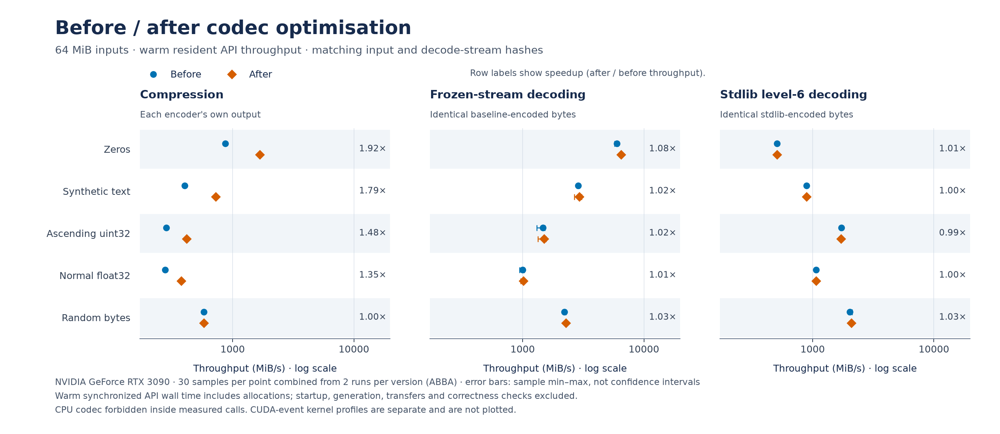

# General byte-stream benchmarks

The reproducible harness uses synthetic byte streams without external datasets.
It measures encoded size, compression throughput and decompression throughput.
Recorded results cover the CUDA codec on an RTX 3090 with same-host CPU
baselines, plus independent Apple CPU baselines. Small-input and large-input
results are shown separately; compressed size and stream layout also matter.

## Workloads

Each workload runs at 64 KiB, 1 MiB and 64 MiB with seed `20261006`:

- `zeros`: all zero bytes, representing extremely compressible input.
- `text`: generated ASCII request records with varying fields. An 8192-record
  block repeats to fill larger inputs; this is synthetic repetitive text.
- `uint32`: ascending counters encoded as little-endian unsigned 32-bit integers.
- `float32`: seeded Gaussian samples encoded as little-endian 32-bit floats.
- `random`: seeded uniformly distributed bytes, representing incompressible input.

Generation and validation occur outside timed regions. Payload SHA-256 hashes,
all timing samples and software versions are recorded in the result JSON.

## Recorded CUDA results

Measured 2026-10-06 on GPU 0 of a two-GPU RTX 3090 workstation (24 GiB per
GPU), with an AMD Ryzen Threadripper PRO 3995WX CPU, Linux x86_64, Python
3.12.3, NumPy 2.2.6, CuPy 13.3.0, CUDA runtime 12.6, NVIDIA driver 610.57.04
and stdlib zlib 1.3. A tested wheel built from the optimised source at
[commit 07e25f1](https://github.com/xangma/cuda-zlib/tree/07e25f1c8eea8356e0c3903f62bc8f328c523a28)
was installed; its six Python module hashes are recorded in the results.
These measurements cover the optimisation branch. The original `0.1.0a1`
release-wheel measurements remain available in
[the archived run](benchmarks/results/rtx3090.json).
All 15 workload/size cases passed byte-exact validation, including stdlib
decoding CUDA output and CUDA decoding independent stdlib level-6 output.
Payload hashes match the recorded Apple CPU run despite different NumPy versions.

Each operation has one untimed warmup, then 15 CUDA samples or five CPU
samples. Tables report median MiB/s, using uncompressed byte counts. CPU figures
below come from the same run and host. These are single-run measurements on a
shared workstation; recorded utilization snapshots do not establish isolation.

With a fresh CuPy cache, imports and CUDA initialization took
0.399 s, and `compile_kernels` took
12.405 s. These startup costs are excluded from the warmed tables.

### Plots

The figures use the recorded RTX 3090 run and its same-host CPU baselines.
Throughput points are medians; error bars show the observed sample range, not
confidence intervals. Logarithmic axes make small and large values visible.
Lines connect measured sizes; intermediate sizes were not measured.


[Compression SVG](benchmarks/figures/compression-throughput.svg) ·
[Compression PDF](benchmarks/figures/compression-throughput.pdf)


The size comparison uses 64 MiB inputs. Encoded percentage is compressed bytes
divided by input bytes; values above 100% indicate expansion.
[Size SVG](benchmarks/figures/encoded-size.svg) ·
[Size PDF](benchmarks/figures/encoded-size.pdf)


These CPU and CUDA workflows decode identical stdlib level-6 streams.
[Decompression SVG](benchmarks/figures/decompression-throughput.svg) ·
[Decompression PDF](benchmarks/figures/decompression-throughput.pdf)


The layout comparison uses 64 MiB inputs and resident GPU timings. Each CPU/CUDA
pair decodes the same stream; codec-produced and stdlib level-6 streams are shown
separately.
[Layout SVG](benchmarks/figures/decode-stream-layout.svg) ·
[Layout PDF](benchmarks/figures/decode-stream-layout.pdf)

To regenerate the figures from a current checkout:

```sh
python -m pip install matplotlib
python benchmarks/plot_results.py
```

The script reads the existing JSON without running CUDA benchmarks. PNG, SVG
and PDF exports and a source-hash manifest are in
[benchmarks/figures](benchmarks/figures).

### 64 MiB encoded size

Encoded percentage is compressed bytes divided by input bytes; lower is better.
Values over 100% indicate expansion. The CUDA compressor has no level equivalent
to zlib's levels 1 or 6, so throughput should be considered alongside these sizes.

| Workload | CUDA | CPU level 1 | CPU level 6 |
| --- | ---: | ---: | ---: |
| Zero bytes | 0.153% | 0.436% | 0.097% |
| Generated text | 13.179% | 12.121% | 10.293% |
| Integer counters | 34.621% | 34.589% | 34.576% |
| Gaussian float32 | 92.629% | 92.886% | 92.617% |
| Uniform random bytes | 100.015% | 100.030% | 100.031% |

### 64 MiB compression throughput

Resident timings exclude initial input upload. Host-to-host timings include input
upload, compression, output download and conversion to host bytes. API output and
workspace allocations remain included in both workflows.

| Workload | CUDA resident | CUDA host-to-host | CPU level 1 | CPU level 6 |
| --- | ---: | ---: | ---: | ---: |
| Zero bytes | 1657.1 | 1423.5 | 402.7 | 165.1 |
| Generated text | 714.5 | 650.2 | 175.7 | 55.4 |
| Integer counters | 413.6 | 387.1 | 49.6 | 6.7 |
| Gaussian float32 | 375.7 | 271.4 | 19.9 | 17.2 |
| Uniform random bytes | 575.6 | 324.7 | 26.2 | 25.3 |

### 64 MiB decompression throughput

Each CPU/CUDA pair decodes the **same compressed stream**. Codec-produced and
stdlib level-6 streams have different block layouts and must be compared separately.
Host-to-host level-6 decoding includes both transfers and host byte conversion.

| Workload | CUDA resident, codec stream | CPU, codec stream | CUDA resident, level-6 stream | CUDA host-to-host, level-6 stream | CPU, level-6 stream |
| --- | ---: | ---: | ---: | ---: | ---: |
| Zero bytes | 5903.0 | 178.9 | 507.4 | 312.2 | 181.0 |
| Generated text | 2897.3 | 238.5 | 881.6 | 419.5 | 292.0 |
| Integer counters | 1502.9 | 166.2 | 1692.4 | 539.2 | 165.9 |
| Gaussian float32 | 1004.6 | 113.9 | 1057.3 | 443.9 | 111.6 |
| Uniform random bytes | 2280.7 | 419.6 | 2084.1 | 546.6 | 419.2 |

For example, resident zero-byte decoding reaches 5903.0 MiB/s for this codec's
stream and 507.4 MiB/s for the level-6 stream. This difference is a property of
the stream layout and decoder paths, not a general speedup over the CPU.

### 64 KiB transfer and launch costs

At 64 MiB, host-to-host CUDA compression exceeded both CPU compression baselines
for all five workloads in this run. At 64 KiB, every measured host-to-host CUDA
compression and level-6 decode was slower than its CPU counterpart:

| Workload | CUDA host compression | CPU level-1 compression | CUDA host decode, level-6 stream | CPU decode, level-6 stream |
| --- | ---: | ---: | ---: | ---: |
| Zero bytes | 17.3 | 552.9 | 22.8 | 252.4 |
| Generated text | 8.8 | 201.5 | 8.9 | 524.2 |
| Integer counters | 5.3 | 52.1 | 4.7 | 204.1 |
| Gaussian float32 | 5.1 | 22.2 | 8.1 | 139.8 |
| Uniform random bytes | 7.7 | 31.0 | 62.3 | 1624.9 |

[Raw optimised RTX 3090 results](benchmarks/results/rtx3090-optimised.json) include all three input
sizes, every sample, min/max timings, host-to-device compression, encoded sizes,
startup measurements and environment metadata. No cross-machine speedup is inferred
from the Apple measurements below.

## Codec optimisation comparison

The following comparison measures the token-cache and decoder changes against
[commit 2829e23](https://github.com/xangma/cuda-zlib/tree/2829e23542ebb0b5b2ff206c9e208214a7ca7cda),
using the same RTX 3090 environment described above. The general tables above
are refreshed measurements of the optimised codec from
[commit 07e25f1](https://github.com/xangma/cuda-zlib/tree/07e25f1c8eea8356e0c3903f62bc8f328c523a28).

The encoder now saves the greedy matcher's tokens for emission instead of
matching twice. A conservative dynamic-code cost bound avoids unnecessary
distance/header trees when dynamic coding cannot improve stored/fixed size.
The decoder avoids reference refinement when emission already resolved every
match, and combines output gathering with Adler32 partials. Validation remains
enabled. All 15 encoded outputs are bit-identical to the baseline; encoded size
and compression ratios are unchanged.



[SVG](benchmarks/figures/optimisation-throughput.svg) ·
[PDF](benchmarks/figures/optimisation-throughput.pdf) ·
[Comparison manifest](benchmarks/figures/optimisation-manifest.json)

These are warm, synchronized resident API timings, including allocations. Four
complete runs used baseline → optimised → optimised → baseline order. Each run
has one warmup and 15 samples per operation; the plots combine all 30 samples
per version without filtering. Uploads, downloads, generation,
validation and compilation are excluded. Decoding uses identical frozen baseline
streams and identical stdlib level-6 streams in each run. The CPU codec is
forbidden inside measured CUDA calls. Error bars show sample extrema, not
confidence intervals. The separate CUDA-event profile records one diagnostic
call per case and named codec kernels; it does not cover every CuPy operation or
represent complete API latency.

At 64 MiB, cells show before → after MiB/s and median wall-time speedup:

| Workload | Compression | Frozen baseline decoding | Stdlib level-6 decoding |
| --- | ---: | ---: | ---: |
| Zero bytes | 868.7 → 1668.9 (1.92×) | 5990.5 → 6483.8 (1.08×) | 507.2 → 510.0 (1.01×) |
| Generated text | 403.6 → 724.5 (1.79×) | 2876.4 → 2939.5 (1.02×) | 890.4 → 893.4 (1.00×) |
| Integer counters | 283.0 → 417.7 (1.48×) | 1473.1 → 1502.7 (1.02×) | 1722.9 → 1713.1 (0.99×) |
| Gaussian float32 | 278.1 → 376.7 (1.35×) | 997.3 → 1011.3 (1.01×) | 1065.5 → 1064.4 (1.00×) |
| Uniform random bytes | 580.1 → 577.5 (1.00×) | 2213.7 → 2281.5 (1.03×) | 2026.8 → 2086.8 (1.03×) |

Decoding gains depend on stream layout. Most decode changes are small, and
sample ranges overlap between versions. Text decode medians also varied between
the two pairs; these measurements do not establish an improvement for every workload.
Compression of random bytes is roughly unchanged. The encoder token workspace
costs four bytes per input byte, or 256 MiB at 64 MiB input. A decode that skips
refinement avoids a second 256 MiB reference array at that output size; the first
reference array remains necessary.

[Combined before profile](benchmarks/results/rerun-before.json) and
[combined after profile](benchmarks/results/rerun-after.json) record all three input
sizes, all wall samples, source hashes and input/stream hashes. They also record
raw-file hashes, run order and sample slices for the four complete runs:
[baseline A](benchmarks/results/rerun-baseline-a.json),
[optimised A](benchmarks/results/rerun-candidate-a.json),
[optimised B](benchmarks/results/rerun-candidate-b.json) and
[baseline B](benchmarks/results/rerun-baseline-b.json).
[Execution receipts](benchmarks/results/rerun-execution.json) record successful
completion, process cleanup and receipt timestamps confirming the run order,
followed by the separate general benchmark used for the CPU/transfer tables.
Kernel diagnostics in each combined profile come only from that version's first
run and are explicitly identified; they are not combined timing measurements.
The merge and plot scripts check matching environments, encoded bytes and exact
decode-input hashes. These are sequential runs on a shared workstation; reversing
run order reduces ordering bias but does not establish isolation. Small changes
should be interpreted alongside the observed variation.

A focused 15-sample repeat at 64 MiB measured frozen-stream decode medians of
43.34 → 42.48 ms for integer counters (1.02×) and 63.76 → 63.11 ms for Gaussian
floats (1.01×). Stdlib-stream decode speedups were 0.99× and 1.00× respectively.
The earlier slower medians were not consistent across these runs; small decoder
changes remain within the observed variation. The original five-sample
[before](benchmarks/results/optimisation-before.json) and
[after](benchmarks/results/optimisation-after.json) profiles are retained as
historical measurements. [Repeat before](benchmarks/results/decoder-repeat-before.json)
and [repeat after](benchmarks/results/decoder-repeat-after.json) preserve the
additional focused measurements.

To reproduce on a CUDA machine from a checkout containing these changes:

```sh
python -m pip install ".[cuda12]" matplotlib
BASELINE="$(mktemp -d)/before"
STREAMS="$(mktemp -d)"
git worktree add --detach "$BASELINE" 2829e23542ebb0b5b2ff206c9e208214a7ca7cda
cp benchmarks/profile.py "$BASELINE/benchmarks/"
PYTHONPATH="$BASELINE/src" python "$BASELINE/benchmarks/profile.py" \
  --samples 15 --output benchmarks/results/rerun-baseline-a.json --save-streams "$STREAMS"
PYTHONPATH=src python benchmarks/profile.py \
  --samples 15 --output benchmarks/results/rerun-candidate-a.json --streams-from "$STREAMS"
PYTHONPATH=src python benchmarks/profile.py \
  --samples 15 --output benchmarks/results/rerun-candidate-b.json --streams-from "$STREAMS"
PYTHONPATH="$BASELINE/src" python "$BASELINE/benchmarks/profile.py" \
  --samples 15 --output benchmarks/results/rerun-baseline-b.json --streams-from "$STREAMS"
python benchmarks/merge_profiles.py
python benchmarks/plot_optimisation.py
```

Use the pinned NumPy/CuPy versions above to reproduce the recorded environment.
Profiling defaults to five samples, seed `20261006`, GPU 0 and all 15 cases.

## Recorded CPU baselines

Measured 2026-10-06 on Apple M4 Max, macOS arm64, Python 3.14.6,
NumPy 2.5.3 and stdlib zlib 1.2.12. Each operation has one untimed warmup
and five measured samples. Timings are single-threaded wall-clock medians;
output allocation is included. This is one run on one workstation.

Encoded percentage is compressed bytes divided by input bytes; lower is better.
Throughput is uncompressed MiB divided by elapsed seconds. Values over 100%
indicate expansion. Decode uses the stream produced by zlib level 6.

| Input | Workload | Encoded, level 1 | Encoded, level 6 | Compress level 1, MiB/s | Compress level 6, MiB/s | Decode level 6, MiB/s |
| --- | --- | ---: | ---: | ---: | ---: | ---: |
| 64 KiB | Zero bytes | 0.468% | 0.128% | 1529.1 | 622.7 | 1554.4 |
| 64 KiB | Generated text | 12.273% | 10.779% | 797.9 | 233.8 | 3401.4 |
| 64 KiB | Integer counters | 34.636% | 34.639% | 190.0 | 18.2 | 698.3 |
| 64 KiB | Gaussian float32 | 92.839% | 92.599% | 58.2 | 45.3 | 529.1 |
| 64 KiB | Uniform random bytes | 100.040% | 100.040% | 88.6 | 90.6 | 10714.9 |
| 1 MiB | Zero bytes | 0.438% | 0.099% | 1217.7 | 571.8 | 3473.7 |
| 1 MiB | Generated text | 12.127% | 10.333% | 559.7 | 184.7 | 4042.4 |
| 1 MiB | Integer counters | 34.590% | 34.578% | 173.1 | 16.8 | 661.9 |
| 1 MiB | Gaussian float32 | 92.888% | 92.625% | 46.2 | 37.8 | 522.9 |
| 1 MiB | Uniform random bytes | 100.031% | 100.031% | 69.5 | 69.6 | 11650.4 |
| 64 MiB | Zero bytes | 0.436% | 0.097% | 1193.7 | 561.2 | 4256.4 |
| 64 MiB | Generated text | 12.121% | 10.293% | 586.7 | 193.8 | 3938.9 |
| 64 MiB | Integer counters | 34.589% | 34.576% | 173.1 | 16.7 | 652.3 |
| 64 MiB | Gaussian float32 | 92.886% | 92.617% | 45.7 | 37.1 | 514.0 |
| 64 MiB | Uniform random bytes | 100.030% | 100.031% | 70.2 | 68.0 | 12113.2 |

[Raw CPU results](benchmarks/results/apple-cpu.json) include every sample and
both levels' decoding measurements. These baselines cannot establish GPU speedup
across machines. CUDA comparisons should use the CPU measurements from the same
CUDA run and the same payload hashes.

## Reproduce

Use a checkout containing this optimisation pass. Install the package and run:

```sh
python -m pip install ".[cuda12]" matplotlib
CUPY_CACHE_DIR="$(mktemp -d)" python benchmarks/benchmark.py \
  --sizes 65536 1048576 67108864 --samples 15 --cpu-samples 5 \
  --seed 20261006 --device 0 --output benchmarks/results/rtx3090-optimised.json
python benchmarks/plot_results.py
```

For the recorded RTX 3090 environment, pin `numpy==2.2.6` and
`cupy-cuda12x==13.3.0`, and select the CUDA 12.6 toolkit with
`CUDA_PATH=/usr/local/cuda-12.6` if a different toolkit is the system default.
The installed codec module hashes and payload hashes should match the raw results.

A fresh CuPy cache separates initial kernel compilation from warm throughput.
The harness records import/CUDA initialization and `compile_kernels` durations
separately. It performs one untimed warmup before each timed operation and
synchronizes the device before and after CUDA calls. Avoid other active GPU
work during measurements; GPU utilization, memory usage and temperature are
recorded before and after the run, but these snapshots do not prove isolation.

CUDA measurements include:

- Compression with resident device input and output, host input to device
  output, and complete host input to host output.
- Resident decompression of codec-produced streams and independent zlib
  level-6 streams, plus complete host-to-host decoding of level-6 streams.
- Single-threaded stdlib zlib compression at levels 1 and 6 and CPU decoding
  of the same compressed streams used by the CUDA decoder.

Resident uploads, workload generation and byte comparisons are excluded from
resident timings. API allocations remain included; host workflows include their
transfers and host copies. All CUDA and CPU results are checked against the
original bytes. Stdlib zlib independently decodes the CUDA compressor's output,
and CUDA decodes the stdlib level-6 output. A failed check stops the run.
The CUDA compressor uses its default 32768-byte chunks; it has no compression
level equivalent to zlib's levels 1 or 6.

For a CPU-only reproduction without CuPy or CUDA:

```sh
python -m pip install numpy
python benchmarks/benchmark.py --cpu-only --cpu-samples 5 \
  --seed 20261006 --output results-cpu.json
```

For a focused smoke check, add `--sizes 65536 --samples 1 --cpu-samples 1`.
Small inputs can be dominated by launch and transfer costs. Highly repetitive
streams can exercise different decoding paths from random bytes. Compare both
encoded size and end-to-end throughput for the intended workload; synthetic
results and the alpha codec's documented bounds are not a universal performance
or compatibility guarantee.
