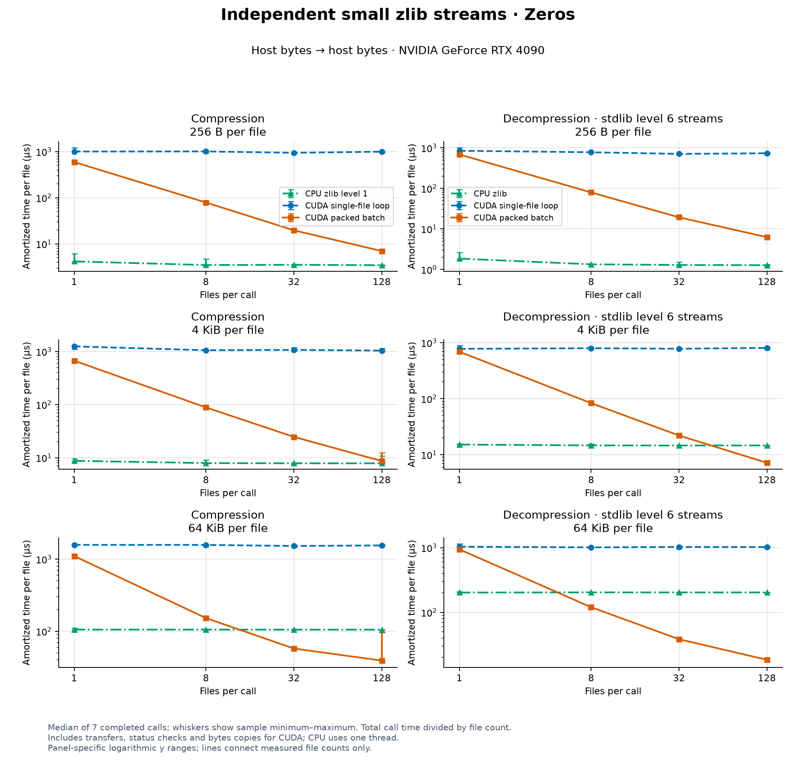
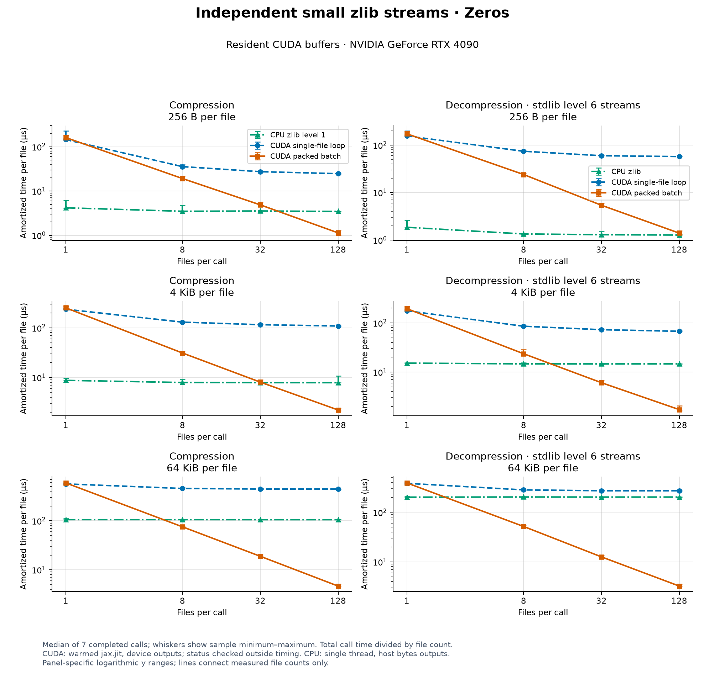
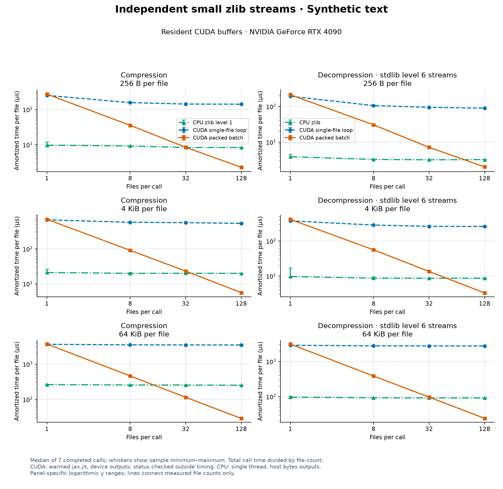
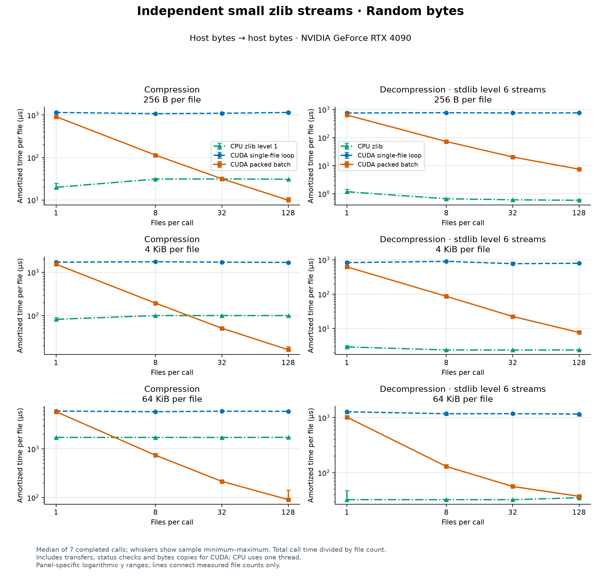
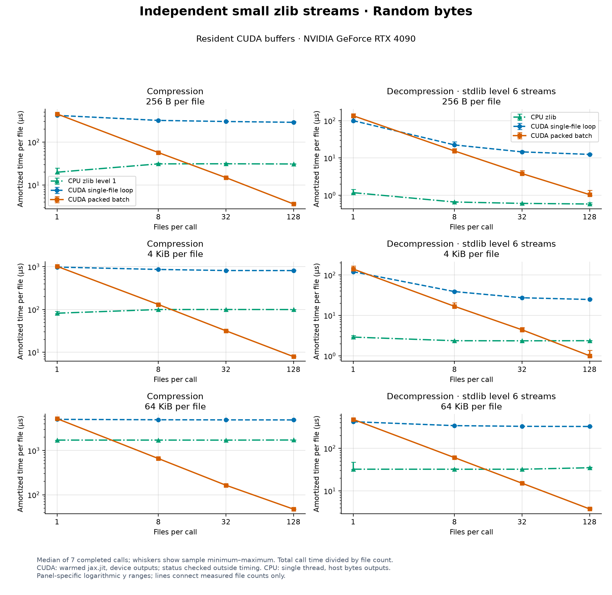

# General byte-stream benchmarks

Three timing scopes are reported separately on an RTX 4090 and an AMD
Threadripper PRO 3995WX. CPU comparisons use single-threaded stdlib zlib on the
same host. Compiled resident measurements exclude transfers and host status
checks; host-byte measurements include packing, transfers and byte copies.

| Dataset | Inputs | CUDA timing scope | CPU comparison |
| --- | --- | --- | --- |
| Single streams | 64 KiB, 1 MiB, 64 MiB; five workloads | Eager exact-length APIs; resident and host outputs reported separately | Same-host CPU, with matching host-byte outputs for speedup |
| Independent small files | 256 B, 4 KiB, 64 KiB; 1, 8, 32, 128 files | Compiled resident calls and synchronous host-byte calls | Same-host CPU processing the same files |
| Resident checked decode | 64 KiB–64 MiB; five workloads | One completed checked `jax.jit` call | None; no CPU speedup inferred |

Compression levels are not equivalent across codecs. Read throughput alongside
encoded size. These synthetic workloads and one shared workstation do not
establish an exact crossover or measure parallel CPU compression.

The compressor divides input into independent **32 KiB chunks** by default,
which can be encoded concurrently. External DEFLATE streams can contain larger
compressed blocks, variable-length Huffman codes and back-references into
earlier output, including across block boundaries up to 32 KiB away.
[RFC 1951](https://www.rfc-editor.org/rfc/rfc1951.html#section-2) describes these
block and history rules. Those parsing and history dependencies can limit the
parallel work available during decoding, so results are separated by stream
layout and timing scope.

## Single-stream results on RTX 4090

For **64 MiB** inputs, warm host-byte compression measured **7.63–16.90×** CPU
zlib level-1 throughput. Decompression of identical stdlib level-6 streams
measured **1.13–5.35×** CPU throughput. Both comparisons include GPU uploads,
downloads, allocations, codec status checks and conversion to Python `bytes`.
At **64 KiB**, CPU compression and decompression were faster for every workload.
At **1 MiB**, host-byte compression measured **1.04–5.21×** CPU level-1
throughput. Generated-text compression was near parity. Decompression was faster
on CUDA for zeros (**1.16×**) and Gaussian float32 (**1.40×**); CPU won the
other three workloads.

### GPU versus CPU, including transfers

**Speedup = CPU median elapsed time / CUDA median elapsed time.** Above 1× favors
CUDA; below 1× favors CPU. Compression compares `cuda_compress_host_host` with
CPU compression. Decompression compares `cuda_decompress_level6_host_host` with
CPU decoding the identical level-6 stream. The host-array workflow returns a
read-only NumPy view of pinned storage; the host-byte workflow additionally
calls `.tobytes()`. CPU speedup uses matching Python `bytes` outputs.


[SVG](benchmarks/figures/cpu-speedup.svg) · [PDF](benchmarks/figures/cpu-speedup.pdf)

### 64 MiB speedup

| Workload | Compression vs CPU level 1 | Compression vs CPU level 6 | Decompression vs CPU, level-6 stream |
| --- | ---: | ---: | ---: |
| Zero bytes | 13.30× | 30.81× | 4.22× |
| Generated text | 7.63× | 24.42× | 1.89× |
| Integer counters | 8.78× | 64.61× | 4.31× |
| Gaussian float32 | 16.90× | 18.82× | 5.35× |
| Uniform random bytes | 12.37× | 12.45× | 1.13× |

### Smaller inputs

These ratios have the same host-byte scope; compression uses CPU level 1 and
decompression uses identical level-6 streams.

| Workload | 64 KiB compression | 1 MiB compression | 64 KiB decompression | 1 MiB decompression |
| --- | ---: | ---: | ---: | ---: |
| Zero bytes | 0.08× | 1.51× | 0.21× | 1.16× |
| Generated text | 0.06× | 1.04× | 0.03× | 0.09× |
| Integer counters | 0.13× | 1.73× | 0.02× | 0.58× |
| Gaussian float32 | 0.35× | 4.91× | 0.04× | 1.40× |
| Uniform random bytes | 0.36× | 5.21× | 0.03× | 0.36× |

Only the three recorded sizes were measured. Lines between points do not
identify intermediate performance or a crossover size.

### 64 MiB encoded size

Compressed bytes divided by input bytes; lower is better. Values over 100%
indicate expansion. CUDA uses 32768-byte chunks and has no compression level.

| Workload | CUDA | CPU level 1 | CPU level 6 |
| --- | ---: | ---: | ---: |
| Zero bytes | 0.153% | 0.436% | 0.097% |
| Generated text | 13.179% | 12.121% | 10.293% |
| Integer counters | 34.621% | 34.589% | 34.576% |
| Gaussian float32 | 92.629% | 92.887% | 92.617% |
| Uniform random bytes | 100.015% | 100.030% | 100.031% |


[SVG](benchmarks/figures/encoded-size.svg) · [PDF](benchmarks/figures/encoded-size.pdf)

### 64 MiB compression throughput

Values are **MiB/s of uncompressed input**. Resident inputs and outputs stay on
the GPU; eager API status checks and exact-length slicing remain included.
Host-byte timings include both transfers and output conversion. Allocations
and synchronization are included; startup and warmup compilation are excluded.

| Workload | CUDA resident | CUDA host bytes | CPU level 1 | CPU level 6 |
| --- | ---: | ---: | ---: | ---: |
| Zero bytes | 12299.1 | 5950.0 | 447.3 | 193.1 |
| Generated text | 2141.6 | 1598.6 | 209.5 | 65.5 |
| Integer counters | 936.6 | 541.2 | 61.6 | 8.4 |
| Gaussian float32 | 895.2 | 359.2 | 21.2 | 19.1 |
| Uniform random bytes | 1356.5 | 379.3 | 30.7 | 30.5 |


[SVG](benchmarks/figures/compression-throughput.svg) · [PDF](benchmarks/figures/compression-throughput.pdf)

### 64 MiB decompression throughput

Values are **MiB/s of decoded output**. Each CPU/CUDA pair decodes the same
compressed bytes. Codec-produced and stdlib level-6 streams have different
layouts and are shown separately. Host-array output and host-byte output also
have separate timing scopes.

| Workload | CUDA resident, codec stream | CPU, codec stream | CUDA resident, level-6 stream | CUDA host array, level-6 stream | CUDA host bytes, level-6 stream | CPU, level-6 stream |
| --- | ---: | ---: | ---: | ---: | ---: | ---: |
| Zero bytes | 12227.4 | 215.7 | 4486.8 | 3663.5 | 920.4 | 218.3 |
| Generated text | 7129.4 | 331.9 | 2661.7 | 2208.1 | 783.5 | 415.4 |
| Integer counters | 4157.7 | 205.4 | 4438.2 | 3182.8 | 887.6 | 205.9 |
| Gaussian float32 | 2938.6 | 150.3 | 3075.6 | 2091.8 | 781.1 | 145.9 |
| Uniform random bytes | 6012.4 | 727.1 | 5513.1 | 2896.0 | 842.7 | 746.2 |


[SVG](benchmarks/figures/decompression-throughput.svg) · [PDF](benchmarks/figures/decompression-throughput.pdf)


[SVG](benchmarks/figures/decode-stream-layout.svg) · [PDF](benchmarks/figures/decode-stream-layout.pdf)

The stream-layout figure compares current workflows on identical inputs within
each CPU/CUDA pair. It is separate from the checked JIT dataset below.

[Raw 15-case results](benchmarks/results/rtx4090-20261008.json) contain every sample, encoded size,
payload/stream hash, startup measurement and environment record. There are
15 CUDA samples and five CPU samples per workflow after one untimed warmup.
All timed calls complete; the **last returned output from each workflow** is
checked outside timing against the original bytes. Stdlib decodes CUDA output
and CUDA decodes independent level-6 streams. A failed check stops the run.

## Independent small files on RTX 4090

**CPU was faster for every measured single-file small-input case** (256 B, 4 KiB
and 64 KiB), including resident CUDA workflows.
With **128 independent 64 KiB files**, host-byte compression measured
**2.68–19.06×** CPU level-1 throughput. Host-byte decompression measured
**11.00×** CPU for zeros, **2.10×** for text and **0.94×** for random bytes.

Packing independent streams shares dispatch costs. Each file has its own
wrapper, history and checksum; batch decoding assigns one CUDA warp per file.
The resident single-file comparison is one warmed `jax.jit` containing
independent FFI calls; the packed workflow
uses one batch FFI call. Host single-file timings use a Python loop of
synchronous APIs. Host batch APIs reuse compiled calls for static layouts.

### Amortized latency with 128 files

Values are **microseconds per file = total completed call time / 128**, rather
than individual-file latency. Lower is better. CPU and CUDA host workflows
start and finish with Python `bytes`; CUDA includes packing, transfers, status
checks and output copies. Resident buffers and metadata stay on the GPU.
Decompression uses identical independent stdlib level-6 streams.

| File size | Workload | CPU compression, level 1 | CUDA batch compression, resident | CUDA batch compression, host bytes | CPU decompression | CUDA batch decompression, resident | CUDA batch decompression, host bytes |
| --- | --- | ---: | ---: | ---: | ---: | ---: | ---: |
| 256 B | Zero bytes | 3.46 | 1.13 | 7.00 | 1.27 | 1.40 | 6.27 |
| 256 B | Generated text | 8.40 | 2.30 | 7.99 | 3.24 | 2.03 | 8.34 |
| 256 B | Uniform random bytes | 30.94 | 3.63 | 9.92 | 0.58 | 1.04 | 7.48 |
| 4 KiB | Zero bytes | 7.86 | 2.22 | 8.67 | 14.66 | 1.72 | 7.17 |
| 4 KiB | Generated text | 19.84 | 5.58 | 13.37 | 8.68 | 3.29 | 10.05 |
| 4 KiB | Uniform random bytes | 99.82 | 7.91 | 16.22 | 2.37 | 1.01 | 7.70 |
| 64 KiB | Zero bytes | 105.32 | 4.65 | 39.24 | 203.24 | 3.25 | 18.47 |
| 64 KiB | Generated text | 250.95 | 28.94 | 69.08 | 91.93 | 24.21 | 43.82 |
| 64 KiB | Uniform random bytes | 1729.07 | 47.33 | 90.69 | 35.05 | 3.78 | 37.24 |

### Small-file plots

All six figure families show sizes 256 B, 4 KiB and 64 KiB at counts 1, 8, 32 and
128. Points are medians of seven completed calls; whiskers show sample minimum
and maximum. Lines connect measured counts. Resident calls complete output and
metadata before timing ends; host status checks and oracle checks follow.
Host APIs validate codec status within their timed calls. The first native build
and per-layout XLA compilation are excluded from steady-state timings.



[SVG](benchmarks/figures/small-batch/rtx4090-zeros-host-bytes.svg) · [PDF](benchmarks/figures/small-batch/rtx4090-zeros-host-bytes.pdf)



[SVG](benchmarks/figures/small-batch/rtx4090-zeros-resident.svg) · [PDF](benchmarks/figures/small-batch/rtx4090-zeros-resident.pdf)


[SVG](benchmarks/figures/small-batch/rtx4090-text-host-bytes.svg) · [PDF](benchmarks/figures/small-batch/rtx4090-text-host-bytes.pdf)



[SVG](benchmarks/figures/small-batch/rtx4090-text-resident.svg) · [PDF](benchmarks/figures/small-batch/rtx4090-text-resident.pdf)



[SVG](benchmarks/figures/small-batch/rtx4090-random-host-bytes.svg) · [PDF](benchmarks/figures/small-batch/rtx4090-random-host-bytes.pdf)



[SVG](benchmarks/figures/small-batch/rtx4090-random-resident.svg) · [PDF](benchmarks/figures/small-batch/rtx4090-random-resident.pdf)

[Raw 36-case results](benchmarks/results/small-batch-rtx4090-20261008.json) include seven samples per workflow,
encoded lengths/hashes and an optional compiled padded batch round trip.
Every final returned workflow output passed byte checks; compressed streams
were decoded by stdlib and resident metadata/padding were checked after timing.
Round-trip encoded lengths stay on device; its timings are recorded, not plotted.
The report's `complete` marker is true only after the whole matrix finishes.

## Resident checked decoding on RTX 4090

These measurements use one warmed `jax.jit` checked decode of an independent
stdlib level-6 stream. The input, output and final metadata stay on the device;
completion waits for both returned arrays. Timings exclude compilation, initial
uploads and post-call host status/byte checks. GPU codec validation and temporary
allocations are included. This timing scope differs from the host-byte and eager
API measurements elsewhere; no CPU speedup is inferred from this dataset.

| Stream size | Workload | Compressed bytes | Completed latency (ms) | Throughput (MiB/s) |
| --- | --- | ---: | ---: | ---: |
| 64 KiB | Zero bytes | 84 | 0.418 | 149.7 |
| 64 KiB | Generated text | 7064 | 3.041 | 20.5 |
| 64 KiB | Integer counters | 22701 | 12.212 | 5.1 |
| 64 KiB | Gaussian float32 | 60709 | 11.759 | 5.3 |
| 64 KiB | Uniform random bytes | 65562 | 0.459 | 136.0 |
| 128 KiB | Zero bytes | 149 | 0.546 | 229.1 |
| 128 KiB | Generated text | 13844 | 5.416 | 23.1 |
| 128 KiB | Integer counters | 45357 | 7.065 | 17.7 |
| 128 KiB | Gaussian float32 | 121355 | 4.034 | 31.0 |
| 128 KiB | Uniform random bytes | 131118 | 0.370 | 338.2 |
| 256 KiB | Zero bytes | 277 | 0.855 | 292.3 |
| 256 KiB | Generated text | 27438 | 10.514 | 23.8 |
| 256 KiB | Integer counters | 90669 | 7.042 | 35.5 |
| 256 KiB | Gaussian float32 | 242724 | 4.067 | 61.5 |
| 256 KiB | Uniform random bytes | 262230 | 0.430 | 581.9 |
| 1 MiB | Zero bytes | 1039 | 2.490 | 401.6 |
| 1 MiB | Generated text | 108353 | 18.838 | 53.1 |
| 1 MiB | Integer counters | 362577 | 7.291 | 137.2 |
| 1 MiB | Gaussian float32 | 970987 | 4.225 | 236.7 |
| 1 MiB | Uniform random bytes | 1048902 | 0.643 | 1555.8 |
| 8 MiB | Zero bytes | 8163 | 11.785 | 678.8 |
| 8 MiB | Generated text | 863857 | 19.191 | 416.9 |
| 8 MiB | Integer counters | 2900368 | 7.418 | 1078.5 |
| 8 MiB | Gaussian float32 | 7768654 | 5.501 | 1454.3 |
| 8 MiB | Uniform random bytes | 8391174 | 1.819 | 4397.6 |
| 64 MiB | Zero bytes | 65238 | 13.261 | 4826.2 |
| 64 MiB | Generated text | 6907553 | 23.416 | 2733.2 |
| 64 MiB | Integer counters | 23203543 | 13.502 | 4740.2 |
| 64 MiB | Gaussian float32 | 62154385 | 19.619 | 3262.2 |
| 64 MiB | Uniform random bytes | 67129345 | 11.310 | 5658.6 |


[SVG](benchmarks/figures/resident-checked.svg) · [PDF](benchmarks/figures/resident-checked.pdf)

Medians use 31 completed calls after all shapes are warmed; whiskers show sample
minimum/maximum. Axes are logarithmic. The final returned sample in each case
passed status and independent byte checks; CPU codec functions are forbidden
during every timed CUDA call.
[Raw samples and hashes](benchmarks/results/resident-checked-rtx4090-20261008.json).

Measured 2026-10-08 (Europe/London) on RTX 4090, driver 610.57.04, JAX/JAXlib 0.11.2,
Python 3.12.8 and nvcc 12.1.105. Package and harness hashes match
[d2214ed](https://github.com/xangma/cuda-zlib/tree/d2214ed0bd47e68eaa081f6285c2b5bff3052357).
The raw report identifies the loaded native library with its cache key, library
and build hashes, source/header hashes, compiler, flags and FFI targets.
The private workspace pool ended with
576 MiB retained and zero live scratch, using a 1 GiB release threshold.
Pool reservation excludes JAX inputs and outputs.
See the [workspace bounds](README.md#installation).
The workstation was shared; device snapshots do not establish isolation.

```sh
git checkout d2214ed0bd47e68eaa081f6285c2b5bff3052357
CUDACXX=/path/to/nvcc CUDA_ZLIB_CACHE_DIR=/path/to/codec-cache \
  XLA_PYTHON_CLIENT_PREALLOCATE=false \
  python benchmarks/profile_resident.py --sizes 65536 131072 262144 1048576 8388608 67108864 \
  --workloads zeros text uint32 float32 random --seed 20261008 --samples 31 --output resident.json
python benchmarks/plot_resident.py resident.json --output-dir resident-figures
```

## Workloads

The general and small-file datasets use seed `20261008`. Small-file payloads
use `seed + file_index`; all other payloads use the same seed for each workload.

- `zeros`: all zero bytes.
- `text`: generated ASCII request records with varying fields; an 8192-record
  block repeats to fill larger inputs.
- `uint32`: ascending little-endian unsigned 32-bit counters.
- `float32`: seeded Gaussian samples encoded as little-endian float32.
- `random`: seeded uniform bytes.

Generation, initial resident uploads and post-timing oracle checks are outside
timed regions. Runtime codec validation and allocations are included. Payload
and encoded-stream hashes establish the exact inputs in the raw reports.

## Recorded CUDA results

The general and small-file runs were measured on 2026-10-08 (Europe/London)
using an RTX 4090 and an AMD Threadripper PRO 3995WX on Linux x86_64,
Python 3.12.8, NumPy 2.2.6,
JAX/JAXlib 0.11.2 and stdlib zlib 1.3.1. Driver version was 610.57.04.
JAX reported CUDA platform `cuda 13040`; the native codec compiler was
`nvcc` 12.1.105 targeting `sm_89`. The JAX platform string and native compiler
version describe different components.
File dates use Europe/London; `created_utc` timestamps in the raw reports use UTC.

Measured checkout: [d2214ed](https://github.com/xangma/cuda-zlib/tree/d2214ed0bd47e68eaa081f6285c2b5bff3052357).
Reports record `source_revision`, `harness_sha256` and codec source hashes.
`environment.native_build` identifies the **actually loaded library** with its
cache key, library/build SHA-256 hashes, build identity, FFI targets, compiler,
flags and source/header hashes. The compatible `native_builds` field contains
that single build identity. These records identify the loaded backend separately
from the benchmark harness. Figure manifests pin their source report and exports.

Both runs reused the matching native library in an isolated cache. The recorded
`compile_kernels` time measures cached loading and FFI registration, rather than
a cold build. Startup and final private-pool accounting:

| Run | Imports and CUDA init (s) | Native load and registration (s) | Reserved workspace after run (MiB) | Live scratch after run (bytes) |
| --- | ---: | ---: | ---: | ---: |
| Single streams | 1.172 | 0.009 | 576 | 0 |
| Small-file batches | 1.248 | 0.008 | 64 | 0 |

The release threshold was **1 GiB**. Reserved pages permit reuse and remain
allocated after scratch is freed; this is a retention policy, not a memory cap.
Pool accounting excludes JAX input/output and pinned-host buffers. The general
and small-file runs used `XLA_PYTHON_CLIENT_PREALLOCATE=false`. The workstation
was shared; before/after snapshots do not establish isolation.

Separate [Apple M4 Max CPU reference measurements](benchmarks/CPU_BASELINES.md)
retain their recorded date and environment; they are not GPU speedup baselines.

## Reproduce

Check out the recorded harness and codec, and use a compatible GPU JAX runtime.
The recorded Python and NumPy versions were 3.12.8 and 2.2.6; JAX/JAXlib were
0.11.2. Stdlib zlib's version depends on the Python build.

```sh
git clone https://github.com/xangma/cuda-zlib.git
cd cuda-zlib
git checkout d2214ed0bd47e68eaa081f6285c2b5bff3052357
python -m pip install . matplotlib
export CUDA_ZLIB_CACHE_DIR=/path/to/codec-cache
CUDACXX=/path/to/nvcc XLA_PYTHON_CLIENT_PREALLOCATE=false \
  python -c "import cuda_zlib; cuda_zlib.compile_kernels(0)"
CUDACXX=/path/to/nvcc XLA_PYTHON_CLIENT_PREALLOCATE=false \
  CUDA_ZLIB_WORKSPACE_RETENTION_BYTES=1073741824 \
  python benchmarks/benchmark.py --sizes 65536 1048576 67108864 \
  --workloads zeros text uint32 float32 random --samples 15 --cpu-samples 5 \
  --seed 20261008 --device 0 --output results-cuda.json
python benchmarks/plot_results.py --input results-cuda.json
CUDACXX=/path/to/nvcc XLA_PYTHON_CLIENT_PREALLOCATE=false \
  CUDA_ZLIB_WORKSPACE_RETENTION_BYTES=1073741824 \
  python benchmarks/small_batch.py --sizes 256 4096 65536 --counts 1 8 32 128 \
  --workloads zeros text random --samples 7 --seed 20261008 --device 0 \
  --roundtrip --output small-batch.json
python benchmarks/plot_small_batch.py small-batch.json --output-dir small-batch-figures
```

Install `".[cuda12]"` when selecting JAX's CUDA 12 runtime for a new environment;
the toolkit compiler is installed separately. Set `CUDACXX` to its `nvcc` path.
The native cache key covers codec sources, FFI headers, compiler, architecture,
flags and JAXlib version. The prebuild call above prepares the matching library
before timing its cached load; an empty cache instead includes native compilation
in startup. Native load/build and per-shape XLA compilation are excluded from
steady-state measurements. Each workflow has one untimed warmup.
For a source export without `.git`, set `CUDA_ZLIB_SOURCE_REVISION` to the full
checkout revision; it records supplied metadata, while source hashes identify
the actual files.

Measurement commands above pin their recorded harnesses. To regenerate the
published figures, use the **current checkout's renderers** and recorded JSON
reports, without rerunning CUDA:

```sh
python benchmarks/plot_results.py --input benchmarks/results/rtx4090-20261008.json
python benchmarks/plot_small_batch.py benchmarks/results/small-batch-rtx4090-20261008.json \
  --output-dir benchmarks/figures/small-batch --prefix rtx4090
python benchmarks/plot_resident.py benchmarks/results/resident-checked-rtx4090-20261008.json \
  --output-dir benchmarks/figures
python benchmarks/verify_figures.py
```

The renderers produce PNG, SVG and PDF exports; their versions and source hashes
are recorded in figure manifests. Published exports used Matplotlib 3.11.1 and
NumPy 2.5.2, separately from the NumPy 2.2.6 benchmark environment. General
figures are in [benchmarks/figures](benchmarks/figures), small-file figures in
[benchmarks/figures/small-batch](benchmarks/figures/small-batch).
Use `--validate-only` to check a report without writing figures.

For CPU-only measurements without JAX or CUDA:

```sh
python -m pip install numpy
python benchmarks/benchmark.py --cpu-only --cpu-samples 5 \
  --seed 20261008 --output results-cpu.json
python benchmarks/small_batch.py --cpu-only --samples 7 \
  --seed 20261008 --output small-batch-cpu.json
```

For a focused general smoke check, use `--sizes 65536 --samples 1 --cpu-samples 1`.
Choose workload and output type before comparing timings; these measurements
cover the documented bounded codec and do not establish universal performance.

## Profiling

Capture warmed resident checked decompression with Nsight Systems:

```sh
CUDACXX=/path/to/nvcc python benchmarks/trace.py \
  --nsys /path/to/nsys --output traces/decode --cuda-profiler-single-range -- \
  python benchmarks/profile_resident.py --sizes 1048576 8388608 \
  --workloads zeros text random --cuda-profiler-range --output traces/decode.json
```

The workload warms every requested shape, then completes one decode per case
inside a single continuous profiler range. NVTX labels identify workload and
uncompressed size. Inputs stay resident; both output and status are completed on
the GPU. Status is checked before output bytes after capture, and CPU codec calls
are forbidden during decoding. Capture retains all outputs until the range ends,
so device memory grows with the sum of requested input and output sizes. Use
fewer cases per process when memory is limited. Startup, compilation, uploads,
oracle checks and file writes are outside the capture.

For ordinary completed resident timings, run the workload directly without
`--cuda-profiler-range` and choose `--samples`. These timings exclude initial
uploads and post-call host status/byte checks. They measure a checked JIT API
workflow and have a different scope from host-byte benchmarks above. Timings
under Nsight are diagnostic; use separate normal runs for performance comparisons.
`benchmarks/profile.py` also measures eager compression and both codec-produced
and stdlib streams; `trace.py --cuda-profiler-range` supports its separate ranges.

`trace.py` writes the Nsight report, SQLite export, log and a `.trace.json`
manifest containing the CLI version, capture mode and record counts. It requires
successful execution, imported GPU kernels and CUDA API records, and rejects
known import errors or a disconnected agent even when Nsight returns zero. Choose
a fresh output prefix for each run. The single-range mode stops collection after
one range while allowing the workload to finish its validation.

The default `--nvtx-domain-exclude=TSL` retains CUDA and other NVTX records while
omitting JAX TSL annotations for import compatibility on JAX 0.11.2 / Nsight
Systems 2026.1.3. On a compatible stack, `--nvtx-domain-exclude=""` includes all
domains. Capture workloads leave `environment.gpu_after` unset; collect device
snapshots after `trace.py` exits to avoid subprocesses during deferred export.
