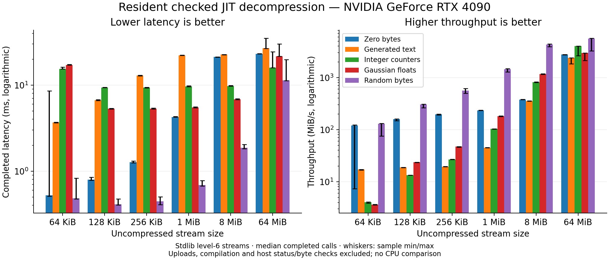

# General byte-stream benchmarks

Two measured datasets are reported separately: independent small files on an
RTX 4090, and single larger streams on an RTX 3090. Each uses single-threaded
stdlib zlib on its own host CPU. Results from different GPUs are not combined.

## Independent small files on RTX 4090

**CPU was faster for every single-file case**, even with resident CUDA buffers.
Including transfers and Python `bytes` outputs, 128-file CUDA batches beat CPU
compression for random data at all three sizes, 4 KiB text, and 64 KiB zero/text
files. The 256-byte text result was near parity at **1.07×** CPU throughput.
CPU was faster for 256-byte zeros and 4 KiB zero compression.
At 64 KiB, batched host compression was **2.66–18.73×** faster than CPU.

Batched host decompression beat CPU for 4 KiB zeros and 64 KiB zero/text files.
CPU was faster for all 256-byte files, 4 KiB text/random files, and 64 KiB random
files. At 64 KiB, CUDA decompression was **11.28×** CPU for zeros, **2.01×**
for text, and near parity at **0.98×** CPU for random bytes.

Packing independent streams into one CUDA call shares dispatch and allows files
to execute concurrently. At 128 files, packed resident compression was
**21–120×** faster than a compiled loop of single-file CUDA calls, and resident
decompression was **12–129×** faster. These ratios compare current CUDA API
workflows; the CPU comparisons above include host transfers and byte outputs.

### Amortized latency with 128 files

Values are **microseconds per file = total completed call time / 128**; they
are not the latency of an individual file. Lower is better. CPU uses one thread
and host `bytes`; CUDA resident inputs/outputs stay on device. CUDA host timings
start and finish with `bytes`, including packing, transfers, status checks and
output copies. Decompression uses identical independent stdlib level-6 streams.

| File size | Workload | CPU compression, level 1 | CUDA batch compression, resident | CUDA batch compression, host bytes | CPU decompression | CUDA batch decompression, resident | CUDA batch decompression, host bytes |
| --- | --- | ---: | ---: | ---: | ---: | ---: | ---: |
| 256 B | Zero bytes | 3.39 | 1.15 | 6.94 | 1.28 | 1.45 | 6.58 |
| 256 B | Generated text | 8.30 | 2.23 | 7.75 | 3.28 | 1.90 | 6.67 |
| 256 B | Random bytes | 30.84 | 3.51 | 10.44 | 0.60 | 1.10 | 6.28 |
| 4 KiB | Zero bytes | 7.91 | 2.04 | 8.53 | 14.70 | 1.86 | 7.78 |
| 4 KiB | Generated text | 19.80 | 5.38 | 13.62 | 8.71 | 3.51 | 10.81 |
| 4 KiB | Random bytes | 99.94 | 7.77 | 16.21 | 2.39 | 1.40 | 8.39 |
| 64 KiB | Zero bytes | 105.30 | 4.67 | 39.58 | 223.75 | 4.14 | 19.84 |
| 64 KiB | Generated text | 251.35 | 28.85 | 67.04 | 92.08 | 27.21 | 45.79 |
| 64 KiB | Random bytes | 1723.82 | 47.40 | 92.04 | 35.12 | 3.64 | 35.80 |

### Small-file plots

The plots show 256 B, 4 KiB and 64 KiB files at counts 1, 8, 32 and 128.
Points are medians of seven completed calls; whiskers show sample minimum and
maximum. Lines connect measured counts, not an inferred crossover. The
resident single-file comparison is one warmed `jax.jit` containing independent
FFI calls; the packed workflow uses one batch FFI call. Host single-file timings
use synchronous convenience APIs in a Python loop. Resident timings wait for
all returned arrays, including metadata; metadata transfer and status checks
occur afterward. Host batch APIs reuse compiled calls for each static file
layout; their first compilation is excluded by warmup. Host APIs check status
before returning.


[Host text SVG](benchmarks/figures/small-batch/rtx4090-text-host-bytes.svg) ·
[Host text PDF](benchmarks/figures/small-batch/rtx4090-text-host-bytes.pdf) ·
[Resident text plot](benchmarks/figures/small-batch/rtx4090-text-resident.png) ·
[Zero-byte host plot](benchmarks/figures/small-batch/rtx4090-zeros-host-bytes.png) ·
[Random-byte host plot](benchmarks/figures/small-batch/rtx4090-random-host-bytes.png).
All six plots have PNG, SVG and PDF exports in
[the small-file figure directory](benchmarks/figures/small-batch).

### Small-file environment and reproduction

Measured 2026-10-07 on an RTX 4090 with an AMD Threadripper PRO 3995WX,
Linux x86_64, Python 3.12.8, NumPy 2.2.6, JAX/JAXlib 0.11.2 and zlib 1.3.1.
JAX reported CUDA platform `cuda 13040`, driver 610.57.04; the native library
used `nvcc` 12.1.105 for `sm_89`. All codec and harness hashes in `source.sha256` in the
[raw 36-case report](benchmarks/results/small-batch-rtx4090-20261007.json)
match [23d40f5](https://github.com/xangma/cuda-zlib/tree/23d40f51d803ea466fd4f31f4ab0f04234cdeafe).
The staging directory was a source export without Git metadata; exact source
SHA-256 hashes establish that snapshot. Payload and compressed-stream hashes,
all samples, software versions and native build flags are also recorded.
`environment.native_builds` inventories the cache entries;
it is not a list of libraries loaded for this run.

Each workflow has one untimed warmup, including per-shape XLA compilation,
and seven timed completed calls. Native build/registration, initial resident
uploads, payload generation and oracle checks are excluded. Benchmark oracle
checks of status, bytes and zero padding occur after timing; host APIs also
validate status within their timed calls. Stdlib decodes CUDA output, and CUDA
decodes independent stdlib streams. All 36 cases passed, including a compiled
padded batch round trip with encoded lengths kept on device; round-trip samples
are in the JSON but are not plotted. Compression sizes differ between codecs;
encoded sizes are recorded and CUDA has no equivalent to zlib's levels.

The native cache was already built: imports/CUDA initialization took 1.159 s,
and cache load/registration took 0.008 s. This does not measure a cold native
build. The private workspace pool used a 1 GiB retention threshold and ended
with 64 MiB reserved and zero live scratch. This was a shared workstation;
utilization snapshots do not prove isolation. No parallel CPU codec baseline
was measured.

```sh
git checkout 23d40f51d803ea466fd4f31f4ab0f04234cdeafe
python -m pip install . matplotlib
CUDACXX=/path/to/nvcc XLA_PYTHON_CLIENT_PREALLOCATE=false \
  python benchmarks/small_batch.py --sizes 256 4096 65536 \
  --counts 1 8 32 128 --workloads zeros text random --samples 7 \
  --seed 20261007 --device 0 --roundtrip --output small-batch.json
python benchmarks/plot_small_batch.py small-batch.json \
  --output-dir small-batch-figures
```

Use an existing compatible GPU JAX installation, or install `".[cuda12]"`
when setting up a CUDA 12 runtime. `--cpu-only`
runs real CPU measurements without JAX or CUDA. The plotter rejects incomplete
matrices and inconsistent summaries; its manifest hashes every export and the
source report.

## Resident checked decoding on RTX 4090

These measurements use one warmed `jax.jit` checked decode of an independent
stdlib level-6 stream. The input, output and final metadata stay on the device;
completion waits for both returned arrays. Timings exclude compilation, initial
uploads and post-call host status/byte checks. GPU codec validation and temporary
allocations are included. This timing scope differs from the host-byte and eager
API measurements elsewhere; no CPU speedup is inferred from this dataset.

| Stream size | Workload | Compressed bytes | Completed latency (ms) | Throughput (MiB/s) |
| --- | --- | ---: | ---: | ---: |
| 64 KiB | Zero bytes | 84 | 0.525 | 119.1 |
| 64 KiB | Generated text | 7064 | 3.662 | 17.1 |
| 64 KiB | Integer counters | 22701 | 15.420 | 4.1 |
| 64 KiB | Gaussian floats | 60690 | 17.159 | 3.6 |
| 64 KiB | Random bytes | 65562 | 0.482 | 129.7 |
| 128 KiB | Zero bytes | 149 | 0.793 | 157.6 |
| 128 KiB | Generated text | 13844 | 6.657 | 18.8 |
| 128 KiB | Integer counters | 45357 | 9.341 | 13.4 |
| 128 KiB | Gaussian floats | 121341 | 5.309 | 23.5 |
| 128 KiB | Random bytes | 131118 | 0.410 | 304.7 |
| 256 KiB | Zero bytes | 277 | 1.266 | 197.5 |
| 256 KiB | Generated text | 27438 | 12.866 | 19.4 |
| 256 KiB | Integer counters | 90669 | 9.329 | 26.8 |
| 256 KiB | Gaussian floats | 242751 | 5.309 | 47.1 |
| 256 KiB | Random bytes | 262230 | 0.445 | 561.8 |
| 1 MiB | Zero bytes | 1039 | 4.262 | 234.6 |
| 1 MiB | Generated text | 108353 | 22.218 | 45.0 |
| 1 MiB | Integer counters | 362577 | 9.629 | 103.8 |
| 1 MiB | Gaussian floats | 971070 | 5.495 | 182.0 |
| 1 MiB | Random bytes | 1048902 | 0.691 | 1447.5 |
| 8 MiB | Zero bytes | 8163 | 21.198 | 377.4 |
| 8 MiB | Generated text | 863857 | 22.591 | 354.1 |
| 8 MiB | Integer counters | 2900368 | 9.756 | 820.0 |
| 8 MiB | Gaussian floats | 7769095 | 6.834 | 1170.6 |
| 8 MiB | Random bytes | 8391174 | 1.869 | 4280.9 |
| 64 MiB | Zero bytes | 65238 | 23.136 | 2766.3 |
| 64 MiB | Generated text | 6907553 | 26.782 | 2389.7 |
| 64 MiB | Integer counters | 23203543 | 15.970 | 4007.6 |
| 64 MiB | Gaussian floats | 62153557 | 21.658 | 2955.0 |
| 64 MiB | Random bytes | 67129345 | 11.336 | 5645.9 |



Medians use 31 completed calls after all shapes are warmed; whiskers show sample
minimum/maximum. Axes are logarithmic. The final returned sample in each case
passed status and independent byte checks; CPU codec functions are forbidden
during every timed CUDA call.
[SVG](benchmarks/figures/resident-checked.svg) ·
[PDF](benchmarks/figures/resident-checked.pdf) ·
[Raw samples and hashes](benchmarks/results/resident-checked-rtx4090-20261007.json).

Measured 2026-10-07 on RTX 4090, driver 610.57.04, JAX/JAXlib 0.11.2,
Python 3.12.8 and nvcc 12.1.105. Package and harness hashes match
[cb5a629](https://github.com/xangma/cuda-zlib/tree/cb5a6299a26a9221bbac7e6f1201ce052930bcc9).
The raw report records the loaded native library's cache identity, source/header
hashes, compiler and flags. The private workspace pool ended with
576 MiB retained and zero live scratch, using a 1 GiB release threshold.
Pool reservation excludes JAX inputs and outputs. Decoding above 64 KiB eagerly
allocates reference, candidate and summary buffers; see the [workspace bounds](README.md#installation).
The workstation was shared; device snapshots do not establish isolation.

```sh
git checkout cb5a6299a26a9221bbac7e6f1201ce052930bcc9
CUDACXX=/path/to/nvcc XLA_PYTHON_CLIENT_PREALLOCATE=false \
  python benchmarks/profile_resident.py --sizes 65536 131072 262144 1048576 8388608 67108864 \
  --workloads zeros text uint32 float32 random --seed 20261007 --samples 31 --output resident.json
python benchmarks/plot_resident.py resident.json --output-dir resident-figures
```

## Single-stream results on RTX 3090

These results compare cuda-zlib on an **RTX 3090** with **single-threaded stdlib
zlib on the same AMD Threadripper PRO 3995WX CPU**, using five synthetic workloads
at 64 KiB, 1 MiB and 64 MiB.

For warm **64 MiB** inputs, CUDA compression achieved **3.88–12.52×** CPU zlib
level-1 throughput. CUDA decompression achieved **1.06–4.42×** CPU throughput
on identical stdlib level-6 streams; CUDA was faster across all five workloads,
with random bytes close to CPU parity.
**Both comparisons include uploads, downloads, codec validation and conversion
to host bytes.** At **64 KiB**, CPU compression and
decompression were faster for every workload. At **1 MiB**, compression was
mixed and CPU decompression was faster for every workload.

Compression sizes differ between codecs; the CUDA compressor has no equivalent
to zlib's compression levels. Read throughput alongside encoded size. These
single-threaded CPU baselines do not measure parallel CPU compression.

## GPU versus CPU, including transfers

**Speedup = CPU median elapsed time / CUDA median elapsed time.** Above 1× favors
CUDA; below 1× favors CPU. The CUDA workflows used in these ratios start and
finish with Python `bytes`.
Compression includes upload, encoding, download and host conversion; decompression
includes upload, decoding, download and host conversion. Allocations, codec
validation and synchronization are included; startup is excluded. CPU and CUDA
decompression use identical stdlib level-6 compressed bytes.

The bytes-returning decompression workflow uses
`decompress_zlib_host(payload, expected_bytes, device).tobytes()`. The separate
host-array workflow returns a completed, read-only, contiguous NumPy `uint8`
array backed by JAX-owned pinned host memory. Its timing includes upload,
decoding and the transfer to host memory, and excludes the final copy into
Python `bytes`. CPU speedup ratios use the bytes-returning workflow so both
outputs have the same type. A `memoryview` of the host array shares its storage
without another copy.


[Speedup SVG](benchmarks/figures/cpu-speedup.svg) ·
[Speedup PDF](benchmarks/figures/cpu-speedup.pdf)

### 64 MiB speedup

| Workload | Compression vs CPU level 1 | Compression vs CPU level 6 | Decompression vs CPU, identical level-6 stream |
| --- | ---: | ---: | ---: |
| Zero bytes | 4.14× | 9.58× | 3.68× |
| Generated text | 3.88× | 12.41× | 2.06× |
| Integer counters | 6.32× | 45.42× | 3.67× |
| Gaussian float32 | 12.52× | 13.96× | 4.42× |
| Uniform random bytes | 10.34× | 10.35× | 1.06× |

### Smaller inputs

These ratios use CPU level 1 for compression and identical level-6 streams for
decompression, with the same host-to-host CUDA timing scope as above.

| Workload | 64 KiB compression | 1 MiB compression | 64 KiB decompression | 1 MiB decompression |
| --- | ---: | ---: | ---: | ---: |
| Zero bytes | 0.03× | 0.71× | 0.13× | 0.39× |
| Generated text | 0.04× | 0.76× | 0.02× | 0.07× |
| Integer counters | 0.10× | 1.58× | 0.02× | 0.34× |
| Gaussian float32 | 0.25× | 4.17× | 0.06× | 0.83× |
| Uniform random bytes | 0.25× | 4.17× | 0.03× | 0.31× |

Only these three sizes were measured; they do not identify an exact crossover
size. Launch and transfer costs make small inputs less favorable to CUDA.

## Workloads

Each workload runs at 64 KiB, 1 MiB and 64 MiB with seed `20261006`:

- `zeros`: all zero bytes, representing extremely compressible input.
- `text`: generated ASCII request records with varying fields. An 8192-record
  block repeats to fill larger inputs; this is synthetic repetitive text.
- `uint32`: ascending counters encoded as little-endian unsigned 32-bit integers.
- `float32`: seeded Gaussian samples encoded as little-endian 32-bit floats.
- `random`: seeded uniformly distributed bytes, representing incompressible input.

Payload generation and post-timing oracle comparisons occur outside timed
regions. Codec framing, bounds, status and checksum validation remain included.
Payload SHA-256 hashes, all timing samples and software versions are recorded in
the result JSON.

## Recorded CUDA results

Measured 2026-10-07 on GPU 0 of a two-GPU RTX 3090 workstation (24 GiB per
GPU), with an AMD Ryzen Threadripper PRO 3995WX CPU, Linux x86_64, Python
3.13.3, NumPy 2.2.5, JAX and JAXlib 0.11.2, the JAX typed CUDA FFI backend,
CUDA 12.6, NVIDIA driver 610.57.04 and stdlib zlib 1.3.1. The native library
was built with `nvcc` 12.6.85 for `sm_86`. The public source checkout is
[0a12b10](https://github.com/xangma/cuda-zlib/tree/0a12b1082ce3dd550a9c9d09bef982342c0dd2be);
its nine codec source SHA-256 hashes, native build flags and FFI header hashes
are recorded in the raw results.
All 15 workload/size cases passed byte-exact validation, including stdlib
decoding CUDA output and CUDA decoding independent stdlib level-6 output.

Each operation has one untimed warmup, then 15 CUDA samples or five CPU
samples. Throughput tables report median MiB/s, using uncompressed byte counts. CPU figures
below come from the same run and host. These are single-run measurements on a
shared workstation; recorded utilization snapshots do not establish isolation.

With a fresh native library cache, imports and CUDA initialization took
1.196 s, and `compile_kernels` took 34.646 s for the native build and FFI
registration. These startup costs and each workflow's initial XLA compilation
are excluded from the warmed tables.

The codec used a **1 GiB release threshold** for its private workspace pool.
After the run, one pool retained **544 MiB** of reserved pages with **0 bytes**
of live scratch. Retaining freed pages allows allocation reuse between calls
at the cost of keeping GPU memory reserved. These warm throughput measurements
use that retention policy; changing the threshold or trimming unused pages can
change subsequent allocation costs. This pool accounting excludes JAX input,
output and pinned-host buffers.

Large compressed inputs use a speculative-prefix queue of about one eighth
the compressed input size. The queue is bounded; dense prefixes use a GPU
fallback path.

### Plots

The figures use the recorded RTX 3090 run and its same-host CPU baselines.
Throughput points are medians; error bars show the observed sample range, not
confidence intervals. The throughput plots use logarithmic axes; the speedup
plot above uses linear axes and labels each ratio directly. Lines connect
measured sizes; intermediate sizes were not measured.


[Compression SVG](benchmarks/figures/compression-throughput.svg) ·
[Compression PDF](benchmarks/figures/compression-throughput.pdf)


The size comparison uses 64 MiB inputs. Encoded percentage is compressed bytes
divided by input bytes; values above 100% indicate expansion.
[Size SVG](benchmarks/figures/encoded-size.svg) ·
[Size PDF](benchmarks/figures/encoded-size.pdf)


These CPU and CUDA workflows decode identical stdlib level-6 streams.
CUDA host-array output and host-byte output are separate timing series;
CPU output is Python `bytes`.
[Decompression SVG](benchmarks/figures/decompression-throughput.svg) ·
[Decompression PDF](benchmarks/figures/decompression-throughput.pdf)


The layout comparison uses 64 MiB inputs and resident GPU timings. Each CPU/CUDA
pair decodes the same stream; codec-produced and stdlib level-6 streams are shown
separately.
[Layout SVG](benchmarks/figures/decode-stream-layout.svg) ·
[Layout PDF](benchmarks/figures/decode-stream-layout.pdf)

To regenerate the figures from a current checkout:

```sh
python -m pip install matplotlib
python benchmarks/plot_results.py --input benchmarks/results/rtx3090-ffi-20261007.json
```

The script reads the existing JSON without running CUDA benchmarks. PNG, SVG
and PDF exports and a source-hash manifest are in
[benchmarks/figures](benchmarks/figures).

### 64 MiB encoded size

Encoded percentage is compressed bytes divided by input bytes; lower is better.
Values over 100% indicate expansion. The CUDA compressor has no level equivalent
to zlib's levels 1 or 6, so throughput should be considered alongside these sizes.

| Workload | CUDA | CPU level 1 | CPU level 6 |
| --- | ---: | ---: | ---: |
| Zero bytes | 0.153% | 0.436% | 0.097% |
| Generated text | 13.179% | 12.121% | 10.293% |
| Integer counters | 34.621% | 34.589% | 34.576% |
| Gaussian float32 | 92.629% | 92.886% | 92.617% |
| Uniform random bytes | 100.015% | 100.030% | 100.031% |

### 64 MiB compression throughput

Resident timings exclude initial input upload. Host-to-host timings include input
upload, compression, output download and conversion to host bytes. API output and
workspace allocations remain included in both workflows.

| Workload | CUDA resident | CUDA host-to-host | CPU level 1 | CPU level 6 |
| --- | ---: | ---: | ---: | ---: |
| Zero bytes | 1780.1 | 1510.9 | 364.8 | 157.7 |
| Generated text | 750.4 | 665.5 | 171.5 | 53.6 |
| Integer counters | 425.1 | 310.6 | 49.1 | 6.8 |
| Gaussian float32 | 379.6 | 217.8 | 17.4 | 15.6 |
| Uniform random bytes | 593.4 | 264.0 | 25.5 | 25.5 |

### 64 MiB decompression throughput

Each CPU/CUDA pair decodes the **same compressed stream**. Codec-produced and
stdlib level-6 streams have different block layouts and must be compared separately.
Host-to-host level-6 decoding includes both transfers and host byte conversion.
Host-array decoding includes both transfers and returns the NumPy view of
completed pinned host storage, without the final copy to Python `bytes`.

| Workload | CUDA resident, codec stream | CPU, codec stream | CUDA resident, level-6 stream | CUDA host array, level-6 stream | CUDA host bytes, level-6 stream | CPU, level-6 stream |
| --- | ---: | ---: | ---: | ---: | ---: | ---: |
| Zero bytes | 9257.0 | 177.9 | 2235.5 | 1987.9 | 665.9 | 180.7 |
| Generated text | 3181.4 | 241.6 | 1540.1 | 1394.3 | 606.5 | 294.6 |
| Integer counters | 1597.8 | 168.6 | 1820.7 | 1561.8 | 620.3 | 168.8 |
| Gaussian float32 | 1181.2 | 122.9 | 1246.3 | 1065.2 | 529.9 | 120.0 |
| Uniform random bytes | 3017.9 | 636.6 | 2797.2 | 1939.0 | 684.5 | 647.4 |

For example, resident zero-byte decoding reaches 9257.0 MiB/s for this codec's
stream and 2235.5 MiB/s for the level-6 stream. This difference is a property of
the stream layout and decoder paths, not a general speedup over the CPU.

[Raw RTX 3090 and same-host CPU results](benchmarks/results/rtx3090-ffi-20261007.json)
include all three input sizes, every sample, min/max timings, host-to-device
compression, encoded sizes, payload hashes, startup measurements and environment
metadata. Separate [Apple M4 Max CPU measurements](benchmarks/CPU_BASELINES.md)
are available for reference; they are not used to calculate GPU speedup.

## Reproduce

Check out the recorded source snapshot, install its dependencies and run the
harness:

```sh
git clone https://github.com/xangma/cuda-zlib.git
cd cuda-zlib
git checkout 0a12b1082ce3dd550a9c9d09bef982342c0dd2be
python -m pip install ".[cuda12]" matplotlib
CUDACXX=/usr/local/cuda-12.6/bin/nvcc CUDA_ZLIB_WORKSPACE_RETENTION_BYTES=1073741824 \
  CUDA_ZLIB_CACHE_DIR="$(mktemp -d)" python benchmarks/benchmark.py \
  --sizes 65536 1048576 67108864 --samples 15 --cpu-samples 5 \
  --seed 20261006 --device 0 --output results-cuda.json
python benchmarks/plot_results.py --input results-cuda.json
```

Select the CUDA toolkit compiler with `CUDACXX`. If it is unset, the runtime
looks for `nvcc` under `CUDA_HOME` or `CUDA_PATH`, then on `PATH`, then at
`/usr/local/cuda/bin/nvcc`. The codec source hashes and payload hashes
should match the raw results.

For the recorded software environment, use Python 3.13.3 and pin
`numpy==2.2.5`, `jax[cuda12]==0.11.2` and `jaxlib==0.11.2`. Stdlib zlib was
1.3.1; its version depends on the Python build.

The JAX FFI backend builds a native CUDA library with `nvcc` and caches it in
`CUDA_ZLIB_CACHE_DIR`, defaulting to `$XDG_CACHE_HOME/cuda-zlib` or
`~/.cache/cuda-zlib`. The persistent cache key covers sources, FFI headers,
compiler path and version, GPU architecture, build flags and JAXlib version.
The fresh temporary cache above measures the initial build rather than cache reuse.

The harness records import/CUDA initialization and `compile_kernels` durations
separately. `compile_kernels` builds or loads the native library and registers
FFI targets; shape-specific XLA compilation remains lazy. One untimed warmup
before each operation excludes that workflow's initial XLA compilation.
CUDA API calls are synchronous, including status checks and temporary workspace;
host workflows include transfers and completed host output. Compression converts
the JAX output to NumPy and Python `bytes`. Decompression uses
`decompress_zlib_host`; the host-array measurement returns its NumPy array and
the bytes-returning measurement additionally calls `.tobytes()`.
Avoid other active GPU work during measurements; GPU utilization, memory usage
and temperature are recorded before and after the run, but these snapshots do
not prove isolation.

CUDA measurements include:

- Compression with resident device input and output, host input to device
  output, and complete host input to host output.
- Resident decompression of codec-produced streams and independent zlib
  level-6 streams, plus level-6 decoding from host input to either a host array
  or Python `bytes`.
- Single-threaded stdlib zlib compression at levels 1 and 6 and CPU decoding
  of the same compressed streams used by the CUDA decoder.

Initial resident uploads, workload generation and post-timing oracle comparisons
are excluded from resident timings. API allocations and codec validation remain
included; host workflows include their transfers and host copies. All CUDA and
CPU results are checked against the original bytes. Stdlib zlib independently
decodes the CUDA compressor's output,
and CUDA decodes the stdlib level-6 output. A failed check stops the run.
The CUDA compressor uses its default 32768-byte chunks; it has no compression
level equivalent to zlib's levels 1 or 6.

For a CPU-only reproduction without JAX or CUDA:

```sh
python -m pip install numpy
python benchmarks/benchmark.py --cpu-only --cpu-samples 5 \
  --seed 20261006 --output results-cpu.json
```

For a focused smoke check, add `--sizes 65536 --samples 1 --cpu-samples 1`.
Small inputs can be dominated by launch and transfer costs. Highly repetitive
streams can exercise different decoding paths from random bytes. Compare both
encoded size and end-to-end throughput for the intended workload; synthetic
results and the alpha codec's documented bounds are not a universal performance
or compatibility guarantee.

## Profiling

Capture warmed resident checked decompression with Nsight Systems:

```sh
CUDACXX=/usr/local/cuda-12.1/bin/nvcc python benchmarks/trace.py \
  --nsys /path/to/nsys --output traces/decode --cuda-profiler-single-range -- \
  python benchmarks/profile_resident.py --sizes 1048576 8388608 \
  --workloads zeros text random --cuda-profiler-range --output traces/decode.json
```

The workload warms every requested shape, then completes one decode per case
inside a single continuous profiler range. NVTX labels identify workload and
uncompressed size. Inputs stay resident; both output and status are completed on
the GPU. Status is checked before output bytes after capture, and CPU codec calls
are forbidden during decoding. Capture retains all outputs until the range ends,
so device memory grows with the sum of requested input and output sizes. Use
fewer cases per process when memory is limited. Startup, compilation, uploads,
oracle checks and file writes are outside the capture.

For ordinary completed resident timings, run the workload directly without
`--cuda-profiler-range` and choose `--samples`. These timings exclude initial
uploads and post-call host status/byte checks. They measure a checked JIT API
workflow and have a different scope from host-byte benchmarks above. Timings
under Nsight are diagnostic; use separate normal runs for performance comparisons.
`benchmarks/profile.py` also measures eager compression and both codec-produced
and stdlib streams; `trace.py --cuda-profiler-range` supports its separate ranges.

`trace.py` writes the Nsight report, SQLite export, log and a `.trace.json`
manifest containing the CLI version, capture mode and record counts. It requires
successful execution, imported GPU kernels and CUDA API records, and rejects
known import errors or a disconnected agent even when Nsight returns zero. Choose
a fresh output prefix for each run. The single-range mode stops collection after
one range while allowing the workload to finish its validation.

The default `--nvtx-domain-exclude=TSL` retains CUDA and other NVTX records while
omitting JAX TSL annotations for import compatibility on JAX 0.11.2 / Nsight
Systems 2026.1.3. On a compatible stack, `--nvtx-domain-exclude=""` includes all
domains. Capture workloads leave `environment.gpu_after` unset; collect device
snapshots after `trace.py` exits to avoid subprocesses during deferred export.
