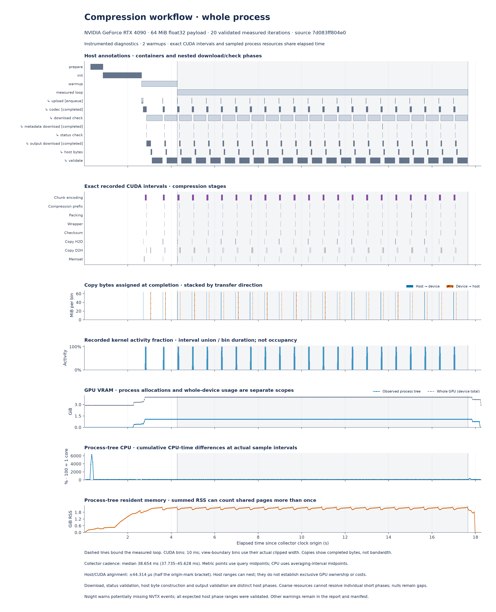
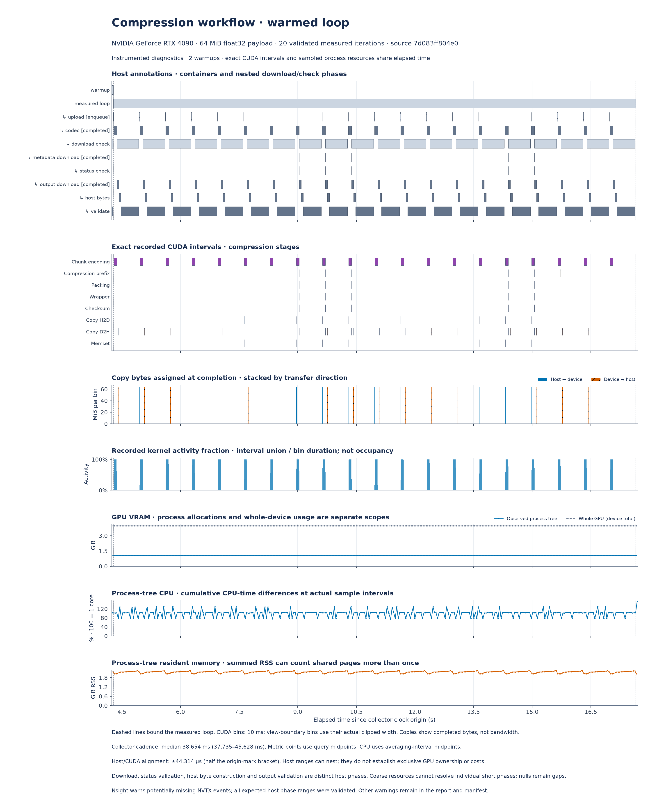
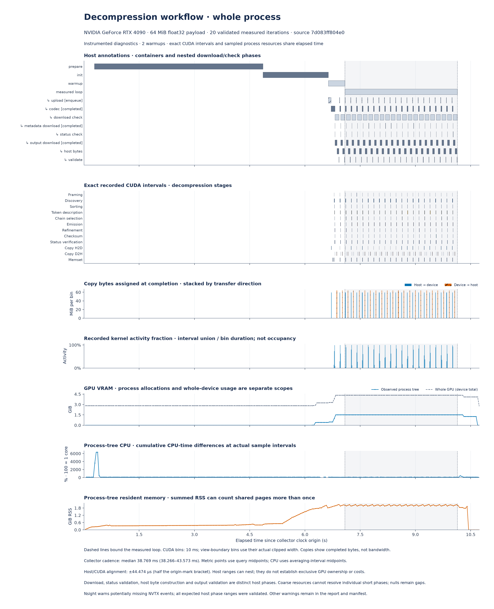
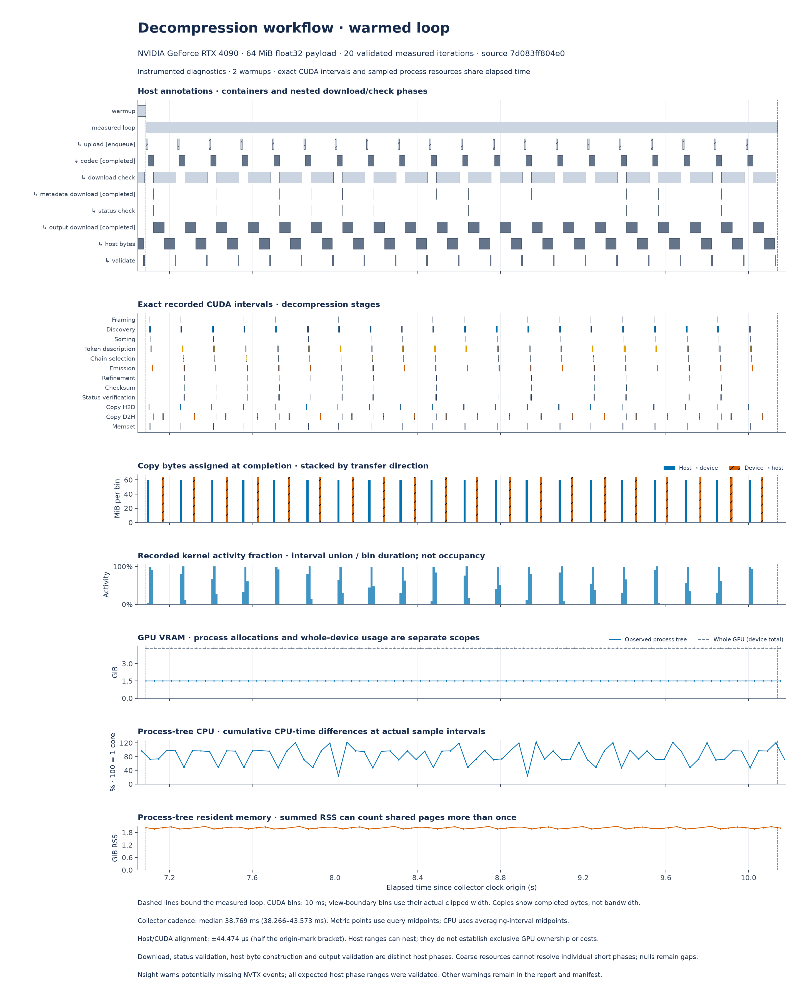

# Compression and decompression profiles on RTX 4090

[Synchronized workflow timelines](#synchronized-workflow-timelines) show host
phases, CUDA activity, transfers and sampled resources. The
[resident decoding stage matrix](#resident-decoding-stage-matrix) compares
recorded kernels across input types and sizes. Use [benchmarks](BENCHMARKS.md)
for throughput, latency and CPU comparisons; these instrumented diagnostics
have different timing scopes.

## Synchronized workflow timelines

Both operations use the same seeded 64 MiB Gaussian float32 payload, two complete
warmups and 20 checked workflows. Each workflow uploads input, completes a JIT
codec call, checks native metadata, downloads output, constructs Python bytes
and validates the result. Decompression consumes an independent stdlib level-6
stream. Compression uses 32 KiB chunks and downloads its full padded array;
only the metadata-validated meaningful prefix becomes bytes.

### Compression



[SVG](benchmarks/figures/workflow/compress-whole-process.svg) ·
[PDF](benchmarks/figures/workflow/compress-whole-process.pdf)



[SVG](benchmarks/figures/workflow/compress-warmed-loop.svg) ·
[PDF](benchmarks/figures/workflow/compress-warmed-loop.pdf)

Compression validation independently decompresses every returned stream with
stdlib zlib and compares its bytes. This CPU oracle is a separate phase outside
the CPU-codec guard. Codec and transfer phases forbid CPU codec calls.

### Decompression



[SVG](benchmarks/figures/workflow/decompress-whole-process.svg) ·
[PDF](benchmarks/figures/workflow/decompress-whole-process.pdf)



[SVG](benchmarks/figures/workflow/decompress-warmed-loop.svg) ·
[PDF](benchmarks/figures/workflow/decompress-warmed-loop.pdf)

Decompression validation compares decoded bytes with the original payload.
Neither operation's validation phase is part of resident codec latency.
These workflows use ordinary `np.asarray(device_array)` output materialization;
the benchmark host-array API, `decompress_zlib_host`, explicitly transfers to
JAX pinned host memory. Their host timing scopes differ.

### Host download and validation costs

The five-condition [instrumentation comparison](benchmarks/results/workflow/instrumentation.json)
uses separate processes, the same fixture and native build, and fresh outputs.
Values below are the measured-loop wall time divided by 20 files, including
validation and time between annotations:

| Condition, in recorded order | Compression (ms/file) | Decompression (ms/file) |
| --- | ---: | ---: |
| Plain, no telemetry or NVTX | 681.8 | 157.0 |
| Process-tree telemetry | 671.2 | 153.5 |
| Telemetry + CUDA/NVTX | 668.5 | 152.7 |
| Telemetry + CUDA/NVTX/OSRT | 667.7 | 155.8 |
| Plain repeat | 671.4 | 154.3 |

The large host costs persist in both plain controls. These sequential shared-host
runs do not isolate small observer effects, but do not support Nsight as the
main cause of the long download/check interval.

Median phase times in the CUDA/NVTX capture separate the costs:

| Phase | Compression (ms) | Decompression (ms) |
| --- | ---: | ---: |
| Completed codec call | 80.94 | 26.70 |
| Metadata materialization | 0.37 | 0.39 |
| Output materialization | 52.01 | 52.08 |
| Recorded output D2H activity within that phase | 3.33 | 3.55 |
| Host array → Python bytes | 48.66 | 51.52 |
| Output validation | 461.65 | 5.44 |

The D2H row is contained in output materialization. Phase medians need not add;
container annotations and gaps have separate scopes. Compression's large
validation interval is the independent CPU decompression oracle. Decompression's
long host interval is mostly output materialization and bytes construction.
These costs do not indicate a GPU decoder stall.

JAX's version-matched [host conversion source](https://github.com/jax-ml/jax/blob/32544801e26115ac1794926d027148abf3baf009/jaxlib/py_array.cc)
allocates value-initialized contiguous host storage before submitting the copy,
which makes allocation/first-touch a concrete hypothesis for part of the
materialization interval; the trace does not time that allocator separately.
Exact installed-wheel-to-upstream-source provenance is unverified. NumPy's
[`tobytes()`](https://numpy.org/doc/stable/reference/generated/numpy.ndarray.tobytes.html)
creates another copy. Keeping a host array or memoryview can avoid that bytes
copy when the caller accepts those output types. Moving validation out of a
performance benchmark changes its timing scope; it does not speed up decoding.

### Pinned transfers and bounded scheduling

A separate [resident-input download diagnostic](benchmarks/results/workflow/rtx4090-download-float32.json)
compares fresh results from the same codecs, with two warmups and 12 measured
cases per mode. Upload is outside these loops; bytes construction and validation
remain inside. The native build and payload match the workflow captures.

| Host route | Compression batch wall time (ms/file) | Decompression batch wall time (ms/file) |
| --- | ---: | ---: |
| Ordinary `np.asarray` | 657.5 | 149.5 |
| Pinned host transfer, serial | 602.9 | 90.8 |
| Pinned host transfer, depth-two queue | 602.4 | 89.6 |

For decompression, ordinary output materialization has medians of **52.9 ms wall
time**, **44.8 ms calling-thread CPU time**, and **16,385 process minor faults**.
Pinned output materialization takes **3.4 ms wall time**, **0.29 ms thread CPU**,
and **zero process minor faults** after warmup. Compression shows the same pattern
(52.2 ms versus 3.4 ms materialization). High thread CPU and minor faults support
host allocation/first-touch as a substantial cost; process fault counters can
also include concurrent JAX activity and do not identify an allocator function.
Major-fault medians are zero.

Pinned transfer leaves the roughly **53 ms** decompression bytes copy intact.
`decompress_zlib_host` already uses this pinned-host route and returns a read-only
NumPy view; `memoryview(result)` shares its storage. Calling `.tobytes()` adds the
allocation and copy shown above. The codec implementation is identical across
these diagnostic modes.

The depth-two queue enqueues the next independent codec result before consuming
the current result. It checks each status before its pinned output copy and
retains at most two results. Its batch totals are close to serial pinned results;
this run does not establish a useful overlap gain. Per-case queue latency has a
different scope from batch time per file, and actual GPU overlap is unproven
without a matching trace. The fixed mode order and shared workstation also
leave allocation/cache/device-state effects possible.

A separate cache probe takes about 52 ms for a fresh ordinary host conversion,
then about 0.07 ms for a second conversion of the same result. That second call
shares cached host storage; it is excluded from all fresh-result summaries.

Reproduce the diagnostic with a fresh output path:

```sh
PYTHONPATH=src CUDA_VISIBLE_DEVICES=0 XLA_PYTHON_CLIENT_PREALLOCATE=false \
python benchmarks/profile_download.py --source-revision "$(git rev-parse HEAD)" \
  --operation both --size 67108864 --iterations 12 --warmups 2 \
  --output /tmp/cuda-zlib-download.json
```

The [command, log and receipt](benchmarks/results/workflow/captures/download)
retain capture provenance. This diagnostic records phase wall/thread CPU times,
process and optional thread page faults, source/native hashes and every output
check. It does not replace host-byte CPU comparisons in [benchmarks](BENCHMARKS.md).

### Reading the panels

All panels share one elapsed-time axis. Dashed lines bound the measured loop;
the zoom includes up to 40 ms of context on each side.

| Panel | Interpretation |
| --- | --- |
| Host annotations | Nested wall-time ranges. Upload enqueues work; codec waits for output and metadata. Download/check contains metadata download, status/extent checks, output download, host bytes conversion and validation. Initialization may also enqueue GPU work. |
| CUDA intervals | Exact recorded kernels, copies and memsets for the worker process tree on the selected physical GPU. Host annotations do not establish exclusive GPU ownership. |
| Transfers | Bytes assigned to 10 ms bins at copy completion, separated by direction; these are not instantaneous PCIe bandwidth. |
| Kernel activity | Union of recorded kernel intervals divided by actual bin duration, including the final partial bin; activity coverage is not occupancy. |
| GPU memory | Observed worker-PID compute allocations alongside whole-device used memory. Other applications contribute to the whole-device line. |
| CPU | Differences in cumulative process-tree CPU time over actual counter intervals; 100% represents one logical CPU. |
| RSS | Summed process-tree resident memory, which can count shared pages more than once. |

Telemetry requests 10 ms polling but records actual query brackets, lifetimes
and errors. Curves use per-metric query midpoints; CPU averages use the midpoint
of the counter interval. The figure states achieved cadence and the NVTX origin
bracket's host/CUDA alignment uncertainty. Resource sampling has its own wider
query windows. Missing observations remain gaps. NVML utilization has a native
reporting window that polling cannot improve.

Every expected host range is checked against the trace and clock brackets.
Collection warnings retain process scope in reports and manifests. Scheduling
information is absent, so intervals without recorded GPU activity are not
attributed to CPU execution, preemption or synchronization. Exclusive annotation
time and unannotated intervals likewise describe wall-time coverage only.

[Normalized compression](benchmarks/results/workflow/rtx4090-compress-float32.json),
[normalized decompression](benchmarks/results/workflow/rtx4090-decompress-float32.json)
and [raw captures](benchmarks/results/workflow/captures) retain runtime, harness,
runner, extractor, native-library and artifact identities. The
[coarse-phase decoding capture](benchmarks/results/timeline/rtx4090-float32.json)
provides the same seven resource/activity panels with fewer host annotations
([whole process](benchmarks/figures/timeline/whole-process.png),
[warmed loop](benchmarks/figures/timeline/warmed-loop.png)).

## Resident decoding stage matrix

These Nsight Systems figures show **recorded GPU activity for one warmed,
checked JIT decoding call per case**. They identify where recorded kernel time
is spent.

The captures use an RTX 4090 on a shared workstation, stdlib zlib level-6 input
streams, and source revision
[`011afd67bfa2d2402706067271dd014e44003260`](https://github.com/xangma/cuda-zlib/tree/011afd67bfa2d2402706067271dd014e44003260).
The matrix covers five synthetic workloads at 64 KiB, 1 MiB and 64 MiB,
plus a 128 KiB integer stream. Inputs are already on the GPU. Native build,
compilation, payload generation, upload, host status reads and output byte
comparisons happen outside the capture. Each result is checked byte for byte
against the CPU oracle after capture; CPU codec calls are forbidden during
the measured call.

**Nsight reports: “Not all CUDA events might have been collected.”** This
diagnostic is retained in the normalized data and figure manifest. Import
succeeded, but these plots cannot establish complete activity collection.
They also do not identify instruction stalls, bandwidth limits or the cause
of time between recorded GPU activities.

## Kernel time by stage


[SVG](benchmarks/figures/nsight/stage-shares.svg) ·
[PDF](benchmarks/figures/nsight/stage-shares.pdf)

Each bar divides the **sum of recorded kernel durations** into stages. Memory
operations and intervals without recorded GPU activity are excluded from this
denominator. The number beside each bar is the kernel sum in milliseconds;
equal bar lengths do not imply equal decoding time. Guarded launches count
even when a kernel takes an early exit.

At 64 MiB, emission has the largest recorded share for zeros, text and integer
counters; discovery has the largest share for float32 and random bytes.
The 128 KiB integer timeline below spends **98.3%** of recorded kernel time in
token description and emission combined. This variation makes workload-specific
profiles useful when choosing what to optimize.

| Stage | Work represented by the recorded kernels |
| --- | --- |
| Fused decode | Small-stream decoding and its internal checks in one kernel; internal stages cannot be timed separately here |
| Framing | Validate stream framing and initialize the general decoder |
| Discovery | Find and validate possible block starts; finalize candidate storage |
| Sorting | CUB radix sort of candidate positions |
| Token description | Parse candidate blocks and optional fixed-block summaries; record extents and output sizes |
| Chain selection | Select the valid block chain |
| Emission | Emit literal or reference roots and stored bytes using the selected emitters |
| Refinement | Resolve reference roots |
| Checksum | Write output bytes and compute/reduce Adler-32 |
| Status verification | Check chain, emission and refinement status and the final result |

## Execution timeline


[SVG](benchmarks/figures/nsight/activity-timeline.svg) ·
[PDF](benchmarks/figures/nsight/activity-timeline.pdf)

Each panel has its own time scale, starting at its first recorded GPU
activity. Every imported kernel, memset and memcpy interval is shown.
**GPU span** runs from the first activity start to the last activity end.
**Uncovered time** is that span minus the union of recorded activity intervals;
it is not attributed to CPU work or synchronization. Kernel and memory sums
can differ from the span and from the harness's completed-call wall time.

## Raw profiles and reproduction

The [capture directory](benchmarks/results/nsight/captures) contains all 16
`.nsys-rep` files, original profile JSON, exact commands, import logs and
capture receipts. Open a report with Nsight Systems, for example
[`uint32-131072.nsys-rep`](benchmarks/results/nsight/captures/uint32-131072.nsys-rep).
The [normalized report](benchmarks/results/nsight/rtx4090-decode.json) records
per-activity durations, geometry, source and native-library identities,
diagnostics and artifact SHA-256 hashes. SQLite exports can be regenerated
from the raw reports; they are not stored in Git.

The published captures use Nsight Systems **2026.1.3**, CUDA toolkit **12.1.105**,
driver **610.57.04**, and JAX/JAXlib **0.11.2**. With a compatible GPU environment,
capture one case from the repository root:

```sh
PYTHONPATH=src CUDA_VISIBLE_DEVICES=0 XLA_PYTHON_CLIENT_PREALLOCATE=false \
nsys profile --trace=cuda --cuda-graph-trace=node --cuda-event-trace=false \
  --sample=none --cpuctxsw=none --capture-range=cudaProfilerApi \
  --capture-range-end=stop --discard-environment=true \
  --output /tmp/uint32-131072 \
  python benchmarks/profile_resident.py --sizes 131072 --workloads uint32 \
    --samples 1 --seed 20261008 --cuda-profiler-range \
    --output /tmp/uint32-131072-profile.json

nsys export --type sqlite --output /tmp/uint32-131072.sqlite \
  /tmp/uint32-131072.nsys-rep
```

Regenerate the figures from the committed normalized data with Matplotlib:

```sh
python benchmarks/plot_nsight.py
python benchmarks/plot_timeline.py
python benchmarks/verify_figures.py
```

Figure verification also checks the measured runtime source, profiling harness,
extractor, raw capture artifacts and all published benchmark figure exports.

To repeat the underlying stage extraction, copy the committed capture directory
to a temporary directory and export every `.nsys-rep` to an adjacent `.sqlite`
file with the command above. Then run:

```sh
python benchmarks/extract_nsight.py --capture-dir /tmp/cuda-zlib-captures \
  --stage-receipt benchmarks/results/nsight/captures/STAGE.json \
  --native-receipt benchmarks/results/nsight/captures/native.json \
  --source-revision 011afd67bfa2d2402706067271dd014e44003260 \
  --reexported-sqlite --output /tmp/rtx4090-decode.json
```

`--reexported-sqlite` explicitly allows SQLite bytes to differ from the original
export. The extractor retains both digests and still checks the raw trace,
source, fixture and launch identities. It rejects unmapped kernels and failed
imports; it retains collection warnings.

### Capture and plot both workflows with one command

Install `psutil`, `nvidia-ml-py`, NumPy and Matplotlib in a compatible CUDA/JAX
profiling environment. Select the UUID from `nvidia-smi -L`, its CUDA-visible
ordinal, and the toolkit's `libnvToolsExt.so`. Prepare the native cache if the
capture should measure cached loading rather than a cold compiler build.
Use an output directory that does not exist:

```sh
PYTHONPATH=src CUDA_VISIBLE_DEVICES=0 XLA_PYTHON_CLIENT_PREALLOCATE=false \
python benchmarks/run_workflow.py --output-dir /tmp/cuda-zlib-workflows \
  --gpu-uuid GPU-YOUR-UUID --device 0 \
  --nvtx-library /usr/local/cuda/lib64/libnvToolsExt.so \
  --operation both --size 67108864 --workload float32 --seed 20261008 \
  --warmups 2 --iterations 20 --sample-ms 10
```

The runner records the checkout revision; for a source archive, supply its full
`--source-revision`. Source hashes identify the actual runtime and harness.
It captures CUDA/NVTX, exports private SQLite intermediates, validates and
normalizes each capture, and renders both whole-process and warmed-loop plots
as PNG, SVG and PDF. Every subprocess has a launch receipt, exact command,
PID, log and stop command. Failure leaves its diagnostic files and stops the
owned launch tree. `--operation compress` or `decompress` selects one codec;
`--no-plots` permits collection without Matplotlib on the GPU host.

Add `--compare-instrumentation` to run, in order, plain, telemetry-only,
CUDA/NVTX, CUDA/NVTX/OSRT, then a second plain control for each operation.
`comparison.json` contains the complete measured-loop duration and separate
phase statistics for every condition. Nested phases must not be added to their
parent duration. This comparison exposes observer effects and drift; it is
separate from same-host CPU speedup benchmarks. `--trace cuda,nvtx,osrt` selects
OSRT for the rendered capture. No affinity or numerical thread limits are forced.

The default `--nvtx-domain-exclude=TSL` preserves application markers and avoids
a string-table import error on JAX 0.11.2 / Nsight Systems 2026.1.3. Captures also
use CUDA toolkit 12.1.105, driver 610.57.04, `psutil` 6.1.1 and
`nvidia-ml-py` 13.615.71. Successful extraction requires imported GPU kernels,
checked workflows, native/source identity, selected physical GPU, clock origin
and unambiguous host launch correlations; collection warnings are retained.

To render the committed reports without CUDA:

```sh
python benchmarks/plot_workflow.py \
  --compress benchmarks/results/workflow/rtx4090-compress-float32.json \
  --decompress benchmarks/results/workflow/rtx4090-decompress-float32.json
python benchmarks/verify_figures.py
```

For separate extraction, `extract_workflow.py` takes `--sqlite`, `--telemetry`,
`--receipt` and `--output`; the runner's `capture.json` records relative files
and hashes. Re-exported SQLite bytes can differ: update only its hash in a copy
of the receipt while preserving raw trace and other artifact hashes.
`--control --telemetry ... --output ...` normalizes a telemetry-only control;
absent CUDA measurements remain null rather than measured zero activity.
