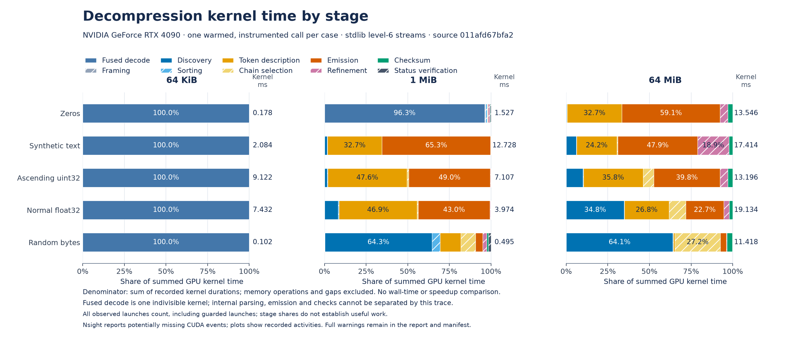
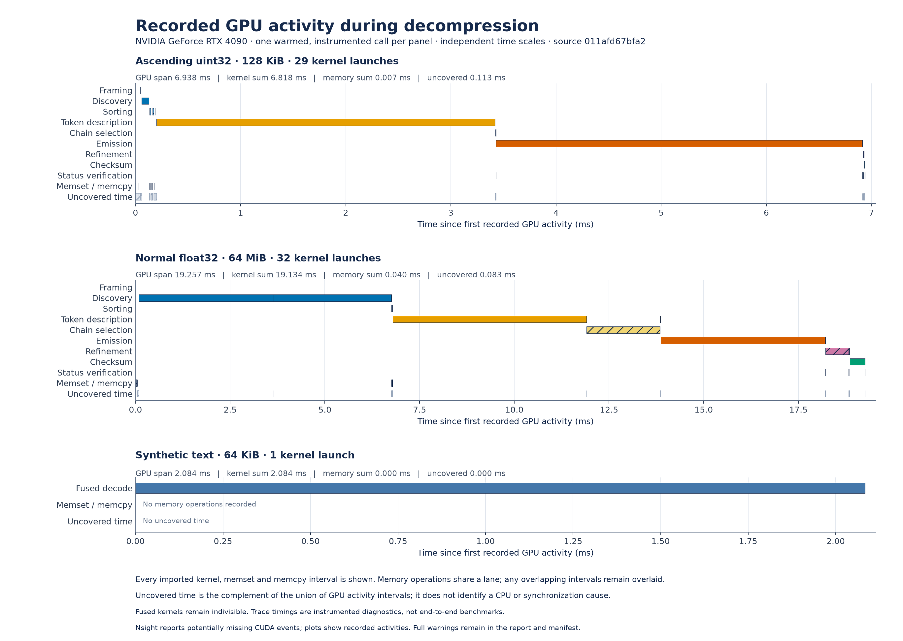

# Decompression stages on RTX 4090

These Nsight Systems figures show **recorded GPU activity for one warmed,
checked JIT decoding call per case**. They identify where recorded kernel time
is spent; use [the benchmark results](BENCHMARKS.md) for throughput, latency and
CPU comparisons. Instrumentation and CUDA graph node tracing add overhead.

The captures use an RTX 4090 on a shared workstation, stdlib zlib level-6 input
streams, and source revision
[`011afd67bfa2d2402706067271dd014e44003260`](https://github.com/xangma/cuda-zlib/tree/011afd67bfa2d2402706067271dd014e44003260).
The matrix covers five synthetic workloads at 64 KiB, 1 MiB and 64 MiB,
plus a 128 KiB integer stream. Inputs are already on the GPU. Native build,
compilation, payload generation, upload, host status reads and output byte
comparisons happen outside the capture. Each result is checked byte for byte
against the CPU oracle after capture; CPU codec calls are forbidden during
the measured call.

**Nsight reports: “Not all CUDA events might have been collected.”** This
diagnostic is retained in the normalized data and figure manifest. Import
succeeded, but these plots cannot establish complete activity collection.
They also do not identify instruction stalls, bandwidth limits or the cause
of time between recorded GPU activities.

## Kernel time by stage



[SVG](benchmarks/figures/nsight/stage-shares.svg) ·
[PDF](benchmarks/figures/nsight/stage-shares.pdf)

Each bar divides the **sum of recorded kernel durations** into stages. Memory
operations and intervals without recorded GPU activity are excluded from this
denominator. The number beside each bar is the kernel sum in milliseconds;
equal bar lengths do not imply equal decoding time. Guarded launches count
even when a kernel takes an early exit.

At 64 MiB, emission has the largest recorded share for zeros, text and integer
counters; discovery has the largest share for float32 and random bytes.
The 128 KiB integer timeline below spends **98.3%** of recorded kernel time in
token description and emission combined. This variation makes workload-specific
profiles useful when choosing what to optimize.

| Stage | Work represented by the recorded kernels |
| --- | --- |
| Fused decode | Small-stream decoding and its internal checks in one kernel; internal stages cannot be timed separately here |
| Framing | Validate stream framing and initialize the general decoder |
| Discovery | Find and validate possible block starts; finalize candidate storage |
| Sorting | CUB radix sort of candidate positions |
| Token description | Parse candidate blocks and optional fixed-block summaries; record extents and output sizes |
| Chain selection | Select the valid block chain |
| Emission | Emit literal or reference roots and stored bytes using the selected emitters |
| Refinement | Resolve reference roots |
| Checksum | Write output bytes and compute/reduce Adler-32 |
| Status verification | Check chain, emission and refinement status and the final result |

## Execution timeline



[SVG](benchmarks/figures/nsight/activity-timeline.svg) ·
[PDF](benchmarks/figures/nsight/activity-timeline.pdf)

Each panel has its own time scale, starting at its first recorded GPU
activity. Every imported kernel, memset and memcpy interval is shown.
**GPU span** runs from the first activity start to the last activity end.
**Uncovered time** is that span minus the union of recorded activity intervals;
it is not attributed to CPU work or synchronization. Kernel and memory sums
can differ from the span and from the harness's completed-call wall time.

## Raw profiles and reproduction

The [capture directory](benchmarks/results/nsight/captures) contains all 16
`.nsys-rep` files, original profile JSON, exact commands, import logs and
capture receipts. Open a report with Nsight Systems, for example
[`uint32-131072.nsys-rep`](benchmarks/results/nsight/captures/uint32-131072.nsys-rep).
The [normalized report](benchmarks/results/nsight/rtx4090-decode.json) records
per-activity durations, geometry, source and native-library identities,
diagnostics and artifact SHA-256 hashes. SQLite exports can be regenerated
from the raw reports; they are not stored in Git.

The published captures use Nsight Systems **2026.1.3**, CUDA toolkit **12.1.105**,
driver **610.57.04**, and JAX/JAXlib **0.11.2**. With a compatible GPU environment,
capture one case from the repository root:

```sh
PYTHONPATH=src CUDA_VISIBLE_DEVICES=0 XLA_PYTHON_CLIENT_PREALLOCATE=false \
nsys profile --trace=cuda --cuda-graph-trace=node --cuda-event-trace=false \
  --sample=none --cpuctxsw=none --capture-range=cudaProfilerApi \
  --capture-range-end=stop --discard-environment=true \
  --output /tmp/uint32-131072 \
  python benchmarks/profile_resident.py --sizes 131072 --workloads uint32 \
    --samples 1 --seed 20261008 --cuda-profiler-range \
    --output /tmp/uint32-131072-profile.json

nsys export --type sqlite --output /tmp/uint32-131072.sqlite \
  /tmp/uint32-131072.nsys-rep
```

Regenerate the figures from the committed normalized data with Matplotlib:

```sh
python benchmarks/plot_nsight.py
python benchmarks/verify_figures.py
```

Figure verification also checks the measured runtime source, profiling harness,
extractor, raw capture artifacts and all published benchmark figure exports.

To repeat the underlying stage extraction, copy the committed capture directory
to a temporary directory and export every `.nsys-rep` to an adjacent `.sqlite`
file with the command above. Then run:

```sh
python benchmarks/extract_nsight.py --capture-dir /tmp/cuda-zlib-captures \
  --stage-receipt benchmarks/results/nsight/captures/STAGE.json \
  --native-receipt benchmarks/results/nsight/captures/native.json \
  --source-revision 011afd67bfa2d2402706067271dd014e44003260 \
  --reexported-sqlite --output /tmp/rtx4090-decode.json
```

`--reexported-sqlite` explicitly allows SQLite bytes to differ from the original
export. The extractor retains both digests and still checks the raw trace,
source, fixture and launch identities. It rejects unmapped kernels and failed
imports; it retains collection warnings.
