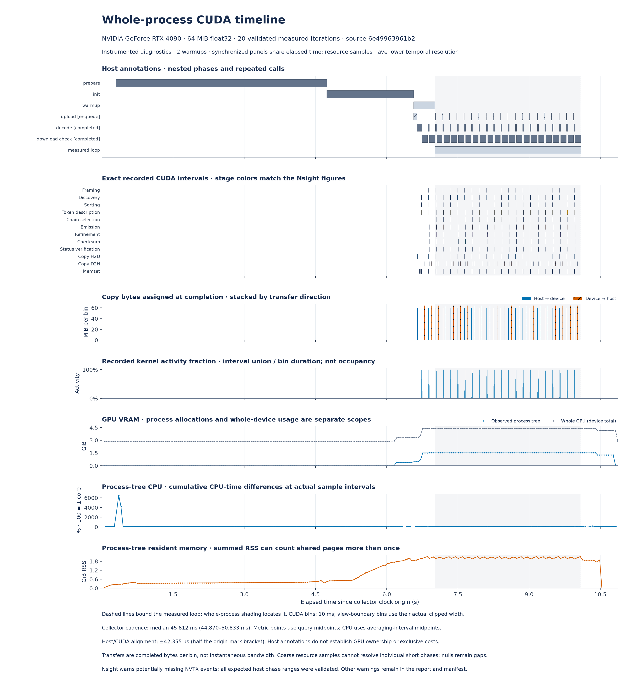
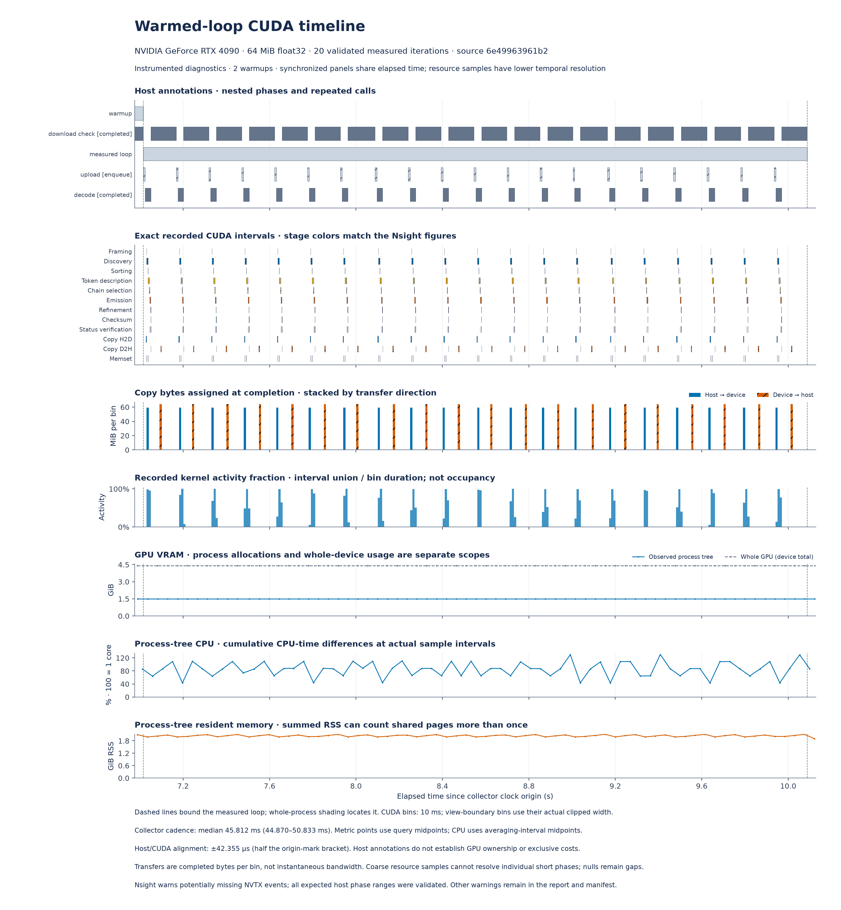

# Decompression profiles on RTX 4090

Two views answer different questions: [the synchronized workflow timeline](#synchronized-workflow-timeline)
shows application phases, CUDA activity, transfers and sampled resources;
[the stage matrix](#kernel-time-by-stage) compares recorded kernels across input types and sizes.
Use [the benchmark results](BENCHMARKS.md) for throughput, latency and CPU comparisons.
Instrumentation and CUDA graph node tracing add overhead.

## Synchronized workflow timeline



[SVG](benchmarks/figures/timeline/whole-process.svg) ·
[PDF](benchmarks/figures/timeline/whole-process.pdf)

This full-process capture decodes a 64 MiB float32 byte stream compressed with
stdlib zlib level 6. It includes input preparation, JAX/native initialization,
two complete warmups and 20 complete checked workflows. Each workflow enqueues
an upload, waits for the checked compiled decoder, reads its status, downloads
the output and verifies every byte. CPU codec calls are forbidden during these
workflows. The native library comes from a verified cache; this capture does
not measure a cold CUDA compiler build.



[SVG](benchmarks/figures/timeline/warmed-loop.svg) ·
[PDF](benchmarks/figures/timeline/warmed-loop.pdf)

The zoom shows the measured loop with up to 40 ms of context on each side.
All panels share one elapsed-time axis. Dashed lines mark the measured loop.

| Panel | Interpretation |
| --- | --- |
| Host annotations | Gray intervals describe nested application phases. Upload is an enqueue interval; decode waits for completion, including its input dependency. Download/check includes metadata and byte validation. |
| CUDA intervals | Exact recorded kernels, copies and memsets for the worker process tree on the selected GPU. Colors use the stage definitions below. |
| Transfers | Bytes assigned to 10 ms bins at copy completion, separated by direction; these are not instantaneous PCIe bandwidth. |
| Kernel activity | Union of recorded kernel intervals divided by actual bin duration, including the final partial bin; this measures activity coverage, not occupancy. |
| GPU memory | NVML compute allocations belonging to observed worker PIDs, alongside whole-device used memory. Other applications contribute to the whole-device line. |
| CPU | Differences in cumulative process-tree CPU time at actual sample intervals; 100% represents one logical CPU. |
| RSS | Summed process-tree resident memory, which can count shared pages more than once. |

The collector requests 10 ms polling and retains the actual query brackets,
timestamps, process lifetimes and query errors. Missing observations remain
gaps. This capture contains 236 resource observations, with a median interval
of 45.8 ms because queries took longer than the requested polling interval.
Resource curves use each metric's query midpoint; CPU averages are placed
at the midpoint of the counter interval. This sampling cannot resolve every
short upload or decode phase. The 10 ms CUDA activity bins have a separate
timing scope. NVML utilization
has its own reporting window; polling does not improve
that resolution. A unique NVTX instant brackets the monotonic clock origin;
the figure states its alignment uncertainty. Host phases do not establish
exclusive GPU costs or the cause of intervals without recorded GPU activity.
The origin bracket gives host/CUDA alignment uncertainty of ±42.355 µs;
resource observations also have their own query windows and sample spacing.
Nsight warns that NVTX collection may be incomplete; all 70 expected host
phase ranges were found and checked against their clock brackets. Warnings
about absent CUDA events refer to the collector and a helper process; the
decoding worker has 704 recorded kernels. Scheduling information is absent,
so no thread scheduling state is inferred. All diagnostics are retained with
their process scope in the report and figure manifest.

The [raw workflow capture](benchmarks/results/timeline/captures/live.nsys-rep),
[telemetry and receipts](benchmarks/results/timeline/captures), and
[normalized report](benchmarks/results/timeline/rtx4090-float32.json) pin the runtime,
profiling harness, native library and artifact hashes. The runtime source is
[`6e49963961b22997e5e802f4f6501720f9a2bebe`](https://github.com/xangma/cuda-zlib/tree/6e49963961b22997e5e802f4f6501720f9a2bebe).
No CPU speedup is inferred from this instrumented workflow.

## Resident decoding stage matrix

These Nsight Systems figures show **recorded GPU activity for one warmed,
checked JIT decoding call per case**. They identify where recorded kernel time
is spent.

The captures use an RTX 4090 on a shared workstation, stdlib zlib level-6 input
streams, and source revision
[`011afd67bfa2d2402706067271dd014e44003260`](https://github.com/xangma/cuda-zlib/tree/011afd67bfa2d2402706067271dd014e44003260).
The matrix covers five synthetic workloads at 64 KiB, 1 MiB and 64 MiB,
plus a 128 KiB integer stream. Inputs are already on the GPU. Native build,
compilation, payload generation, upload, host status reads and output byte
comparisons happen outside the capture. Each result is checked byte for byte
against the CPU oracle after capture; CPU codec calls are forbidden during
the measured call.

**Nsight reports: “Not all CUDA events might have been collected.”** This
diagnostic is retained in the normalized data and figure manifest. Import
succeeded, but these plots cannot establish complete activity collection.
They also do not identify instruction stalls, bandwidth limits or the cause
of time between recorded GPU activities.

## Kernel time by stage


[SVG](benchmarks/figures/nsight/stage-shares.svg) ·
[PDF](benchmarks/figures/nsight/stage-shares.pdf)

Each bar divides the **sum of recorded kernel durations** into stages. Memory
operations and intervals without recorded GPU activity are excluded from this
denominator. The number beside each bar is the kernel sum in milliseconds;
equal bar lengths do not imply equal decoding time. Guarded launches count
even when a kernel takes an early exit.

At 64 MiB, emission has the largest recorded share for zeros, text and integer
counters; discovery has the largest share for float32 and random bytes.
The 128 KiB integer timeline below spends **98.3%** of recorded kernel time in
token description and emission combined. This variation makes workload-specific
profiles useful when choosing what to optimize.

| Stage | Work represented by the recorded kernels |
| --- | --- |
| Fused decode | Small-stream decoding and its internal checks in one kernel; internal stages cannot be timed separately here |
| Framing | Validate stream framing and initialize the general decoder |
| Discovery | Find and validate possible block starts; finalize candidate storage |
| Sorting | CUB radix sort of candidate positions |
| Token description | Parse candidate blocks and optional fixed-block summaries; record extents and output sizes |
| Chain selection | Select the valid block chain |
| Emission | Emit literal or reference roots and stored bytes using the selected emitters |
| Refinement | Resolve reference roots |
| Checksum | Write output bytes and compute/reduce Adler-32 |
| Status verification | Check chain, emission and refinement status and the final result |

## Execution timeline


[SVG](benchmarks/figures/nsight/activity-timeline.svg) ·
[PDF](benchmarks/figures/nsight/activity-timeline.pdf)

Each panel has its own time scale, starting at its first recorded GPU
activity. Every imported kernel, memset and memcpy interval is shown.
**GPU span** runs from the first activity start to the last activity end.
**Uncovered time** is that span minus the union of recorded activity intervals;
it is not attributed to CPU work or synchronization. Kernel and memory sums
can differ from the span and from the harness's completed-call wall time.

## Raw profiles and reproduction

The [capture directory](benchmarks/results/nsight/captures) contains all 16
`.nsys-rep` files, original profile JSON, exact commands, import logs and
capture receipts. Open a report with Nsight Systems, for example
[`uint32-131072.nsys-rep`](benchmarks/results/nsight/captures/uint32-131072.nsys-rep).
The [normalized report](benchmarks/results/nsight/rtx4090-decode.json) records
per-activity durations, geometry, source and native-library identities,
diagnostics and artifact SHA-256 hashes. SQLite exports can be regenerated
from the raw reports; they are not stored in Git.

The published captures use Nsight Systems **2026.1.3**, CUDA toolkit **12.1.105**,
driver **610.57.04**, and JAX/JAXlib **0.11.2**. With a compatible GPU environment,
capture one case from the repository root:

```sh
PYTHONPATH=src CUDA_VISIBLE_DEVICES=0 XLA_PYTHON_CLIENT_PREALLOCATE=false \
nsys profile --trace=cuda --cuda-graph-trace=node --cuda-event-trace=false \
  --sample=none --cpuctxsw=none --capture-range=cudaProfilerApi \
  --capture-range-end=stop --discard-environment=true \
  --output /tmp/uint32-131072 \
  python benchmarks/profile_resident.py --sizes 131072 --workloads uint32 \
    --samples 1 --seed 20261008 --cuda-profiler-range \
    --output /tmp/uint32-131072-profile.json

nsys export --type sqlite --output /tmp/uint32-131072.sqlite \
  /tmp/uint32-131072.nsys-rep
```

Regenerate the figures from the committed normalized data with Matplotlib:

```sh
python benchmarks/plot_nsight.py
python benchmarks/plot_timeline.py
python benchmarks/verify_figures.py
```

Figure verification also checks the measured runtime source, profiling harness,
extractor, raw capture artifacts and all published benchmark figure exports.

To repeat the underlying stage extraction, copy the committed capture directory
to a temporary directory and export every `.nsys-rep` to an adjacent `.sqlite`
file with the command above. Then run:

```sh
python benchmarks/extract_nsight.py --capture-dir /tmp/cuda-zlib-captures \
  --stage-receipt benchmarks/results/nsight/captures/STAGE.json \
  --native-receipt benchmarks/results/nsight/captures/native.json \
  --source-revision 011afd67bfa2d2402706067271dd014e44003260 \
  --reexported-sqlite --output /tmp/rtx4090-decode.json
```

`--reexported-sqlite` explicitly allows SQLite bytes to differ from the original
export. The extractor retains both digests and still checks the raw trace,
source, fixture and launch identities. It rejects unmapped kernels and failed
imports; it retains collection warnings.

### Capturing a synchronized workflow

Install `psutil` and `nvidia-ml-py` in the profiling environment. Select the GPU
UUID shown by `nvidia-smi -L` and its CUDA-visible ordinal. Use a fresh output
directory and the path to the toolkit's `libnvToolsExt.so`:

```sh
mkdir -p /tmp/cuda-zlib-timeline
PYTHONPATH=src CUDA_VISIBLE_DEVICES=0 XLA_PYTHON_CLIENT_PREALLOCATE=false \
nsys profile --trace=cuda,nvtx,osrt --nvtx-domain-exclude=TSL \
  --cuda-graph-trace=node --cuda-event-trace=false --sample=none --cpuctxsw=none \
  --wait=all --discard-environment=true --output /tmp/cuda-zlib-timeline/live \
  python benchmarks/profile_timeline.py --source-revision "$(git rev-parse HEAD)" \
    --gpu-uuid GPU-YOUR-UUID --device 0 \
    --nvtx-library /usr/local/cuda/lib64/libnvToolsExt.so \
    --size 67108864 --workload float32 --seed 20261008 \
    --warmups 2 --iterations 20 --sample-ms 10 \
    --output /tmp/cuda-zlib-timeline/live-telemetry.json

nsys export --type sqlite --output /tmp/cuda-zlib-timeline/live.sqlite \
  /tmp/cuda-zlib-timeline/live.nsys-rep
```

The published capture uses the same Nsight/CUDA/JAX versions as the stage
matrix, with `psutil` 6.1.1 and `nvidia-ml-py` 13.615.71. Excluding the TSL NVTX
domain preserves application markers and avoids a string-table import error on
this stack. No CPU affinity or numerical thread limits are forced.

`extract_timeline.py` takes `--sqlite`, `--telemetry`, `--receipt` and `--output`.
The committed `live-capture.json` shows the receipt schema: relative artifact
paths and SHA-256 hashes, source revision, capture time and toolchain.
SQLite remains a private intermediate. Exporting it again may change its bytes;
record the fresh SQLite hash in a copy of the receipt before extraction.
The extractor validates source/native identity, fixture and completed workflows,
the origin marker, selected physical GPU and host launch correlations. It
rejects failed imports and retains collection warnings.
