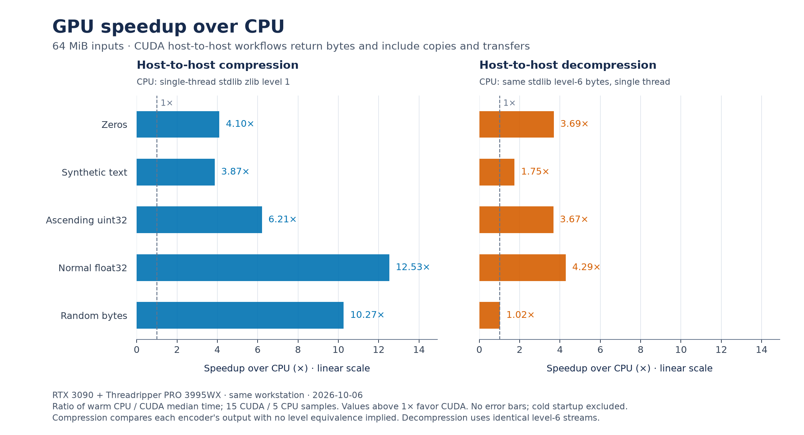

# cuda-zlib

Experimental compression and decompression of general zlib byte streams on CUDA,
using JAX FFI. JAX owns input/output buffers and supplies the CUDA execution
stream. Version `0.1.0a1` is an alpha release; performance and compatibility
depend on the workload and CUDA environment.

```python
import numpy as np
import cuda_zlib

encoded = cuda_zlib.compress_zlib(b"hello" * 1000, device=0)
decoded = cuda_zlib.decompress_zlib(encoded, 5000, device=0)
assert np.asarray(decoded).tobytes() == b"hello" * 1000
```

Both functions accept `bytes` or one-dimensional JAX `uint8` arrays on the
requested CUDA device. `device=` accepts a CUDA ordinal or JAX CUDA device.
They return completed JAX arrays with independent output buffers and check
codec status before returning. No CPU codec fallback occurs. Package import
does not import JAX or initialize CUDA. `cuda_zlib.jax` also provides convenience
wrappers requiring an explicit JAX device.

For output on the host, use `decompress_zlib_host`:

```python
host = cuda_zlib.decompress_zlib_host(encoded, 5000, device=0)
view = memoryview(host)
assert view.readonly
assert view == b"hello" * 1000
```

It accepts the same inputs and validates the same stream features and limits as
`decompress_zlib`. It returns a completed, read-only, contiguous NumPy `uint8`
array. Nonempty outputs use JAX-owned pinned host memory. The array retains its
storage across subsequent calls. `memoryview(host)` shares that storage without
another copy; `host.tobytes()` allocates and copies into a Python `bytes` object.

For compiled workflows, use the fixed-shape interfaces:

```python
import jax

device = jax.devices("gpu")[0]
encode = jax.jit(lambda x: cuda_zlib.compress_zlib_padded(x, device))
buffer, metadata = encode(jax.device_put(np.zeros(4096, dtype=np.uint8), device))
length, status = np.asarray(metadata)
assert status == 0
stream = buffer[:int(length)]

decode = jax.jit(lambda x: cuda_zlib.decompress_zlib_checked(x, 4096, device))
output, metadata = decode(stream)
assert np.asarray(metadata)[0] == 0
```

Compression metadata is `[encoded_length, status]`; the unused buffer tail is
zero padded. Decompression metadata is `[status, 0]`. **Check status before using
output:** zero means success. The synchronous exact-length APIs perform this
check on the host and cannot be used inside `jax.jit`. Devices, chunk sizes and
expected output lengths must be static while tracing. These byte operations
have no automatic differentiation rule. Handler execution includes bounded
host control synchronization; a compiled call does not imply an entirely
asynchronous pipeline.

## Performance

On an RTX 3090 with an AMD Threadripper PRO 3995WX, warm **64 MiB**
compression measured **3.87–12.53×** the throughput of the same CPU's
single-threaded stdlib zlib level 1. Decoding identical stdlib level-6 streams
measured **1.02–4.29×** CPU throughput: GPU decoding was faster for zeros,
synthetic text, uint32 and float32; random bytes were close to CPU parity.
Both comparisons include GPU uploads, downloads, codec validation and conversion
to host bytes. Host-array output is measured separately in the benchmark tables.

At **64 KiB**, CPU compression and decompression were faster for every measured
workload. At **1 MiB**, compression depended on the workload and CPU
decompression was faster throughout. Compression sizes differ between codecs;
these results cover five synthetic workloads and the recorded hardware.

The run used a 1 GiB private-workspace retention threshold and ended with
544 MiB reserved and no live scratch. Retaining unused pages allows workspace
reuse between calls and keeps GPU memory reserved.



See [BENCHMARKS.md](BENCHMARKS.md) for per-workload ratios, compressed sizes,
startup costs, timing scopes and reproduction commands.

## Installation

Install from a source checkout with CUDA-enabled JAX:

```sh
git clone https://github.com/xangma/cuda-zlib.git
cd cuda-zlib
python -m pip install ".[cuda12]"
```

Codec calls require Python 3.12 or later, Linux, an NVIDIA GPU, JAX/JAXlib 0.11.2 or later, and a
compatible CUDA toolkit (12.0 or later) containing `nvcc`. Set `CUDACXX=/path/to/nvcc` or
`CUDA_HOME=/path/to/cuda` when the compiler is not on `PATH`. The `cuda12` extra
installs JAX's CUDA 12 runtime; the toolkit compiler is installed separately.
The `jax` extra installs JAX without selecting its GPU runtime. For an existing
compatible GPU JAX installation, install the base package with
`python -m pip install .`. See [JAX GPU installation instructions](https://docs.jax.dev/en/latest/installation.html).
CPU-only framing and optional-backend tests can run without JAX or CUDA.

The native library builds lazily and persists in
`$XDG_CACHE_HOME/cuda-zlib` (default `~/.cache/cuda-zlib`). Set
`CUDA_ZLIB_CACHE_DIR` to choose another directory. Its cache key includes source,
FFI headers, JAXlib version, CUDA compiler, architecture and compiler options;
process and thread locks serialize cache construction. `compile_kernels(0)`
builds/loads the library explicitly. XLA compilation for each input/output shape
and workflow remains lazy; warm each workflow before measuring steady throughput.
No prebuilt native wheel or PyPI release is provided for this backend.

The decoder supports fresh RFC 1950 zlib streams with stored, fixed, and dynamic
DEFLATE blocks, including cross-block history. It checks CMF/FLG, advertised
window, exact output size, exact stream extent, and original Adler32. It rejects
gzip, raw DEFLATE, dictionaries, concatenation, and trailing bytes. This is a
bounded subset, not a complete implementation of all RFC 1950 features.

Input/output bounds are 256 MiB; candidate and block limits are 262144.
Each invocation uses its own temporary workspace, allocated and freed on XLA's
stream. Private CUDA pools reuse freed workspace allocations, with one pool per
CUDA context and device. The default release threshold is 1 GiB per pool;
it is a retention policy, not a memory limit. Set
`CUDA_ZLIB_WORKSPACE_RETENTION_BYTES=0` before loading the backend to disable
retention, or set another nonnegative byte count. Pool handles live for the
backend's process lifetime. `workspace_pool_stats(device)` reports retained and
live bytes; `trim_workspace_pool(device)` asks CUDA to release unused pages.
Complete outstanding calls first to make their scratch eligible for trimming.

Compression conservatively requires its worst-case encoded extent to
fit the decoder input limit. Each 256–65535 byte chunk has fresh LZ77 history and
one hash candidate. Exact bit costs select stored, fixed or dynamic Huffman
coding; stored blocks bound expansion. There are no zlib compression levels or
dictionaries. Long fixed regions use fresh GPU token-boundary summaries when
the actual stream requires them.

Compression caches match tokens in a workspace of four bytes per input byte
(256 MiB for a 64 MiB input). Decoding skips the second four-byte-per-output-byte
reference workspace when every match resolves within its emitted segment, and
gathers output bytes while calculating checksum partials. Allocation failures
remain possible even within the codec bounds.

`CodecError` means malformed input, integrity failure, or a codec workspace limit.
`UnsupportedStream` means an unsupported wrapper feature. `BackendUnavailable`
means an absent backend, native build/load failure or invalid/unavailable device.
Other argument errors use `TypeError`/`ValueError`; unexpected CUDA/XLA runtime
errors propagate.

## Validation

```sh
python -m pip install ".[test]"
python -m pytest -q tests
```

GitHub CI builds and tests the installed wheel on CPU runners. CUDA tests skip
when the GPU backend is unavailable; CPU CI does not establish GPU correctness.
Tests use stdlib zlib only as an independent oracle/baseline and forbid CPU codec
calls inside CUDA operations.

## License

[MIT](LICENSE), copyright xangma. See [PROVENANCE.md](PROVENANCE.md) for
ownership and dependency information. Dependencies retain their own licenses.
